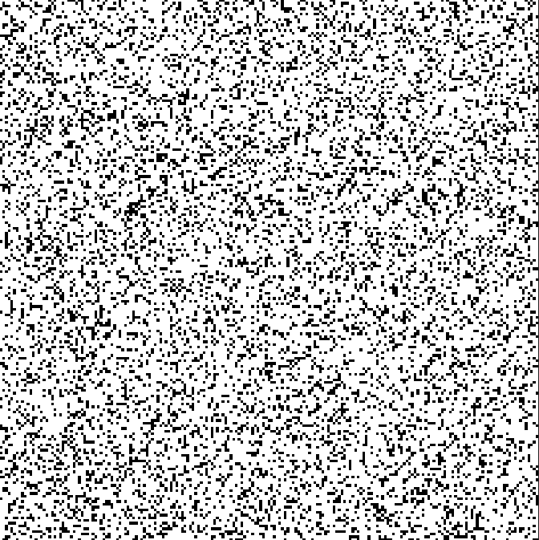
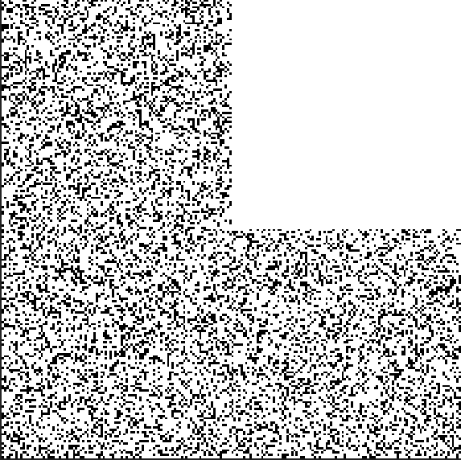
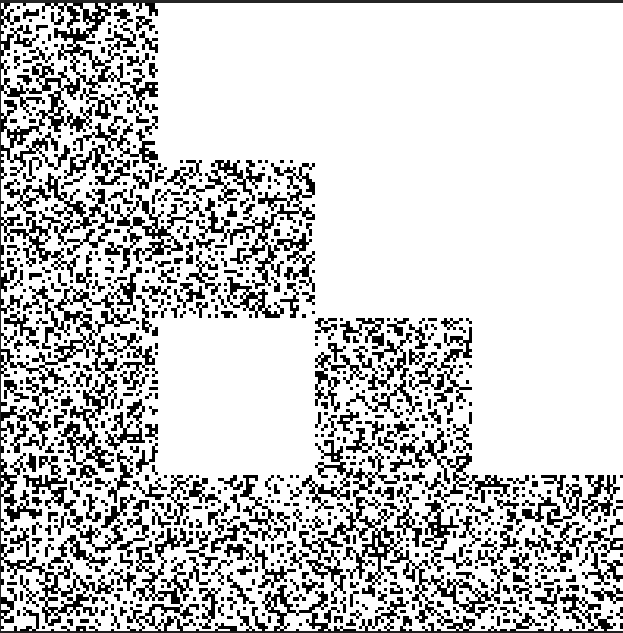
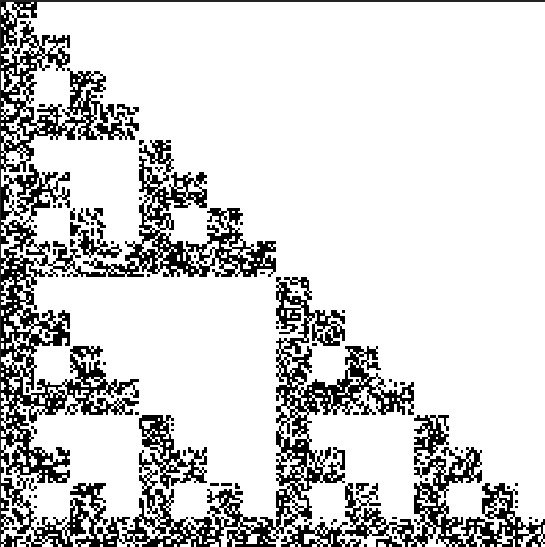
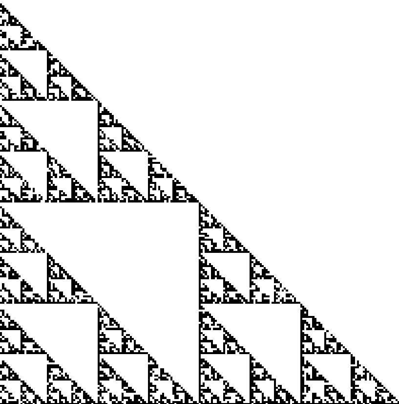
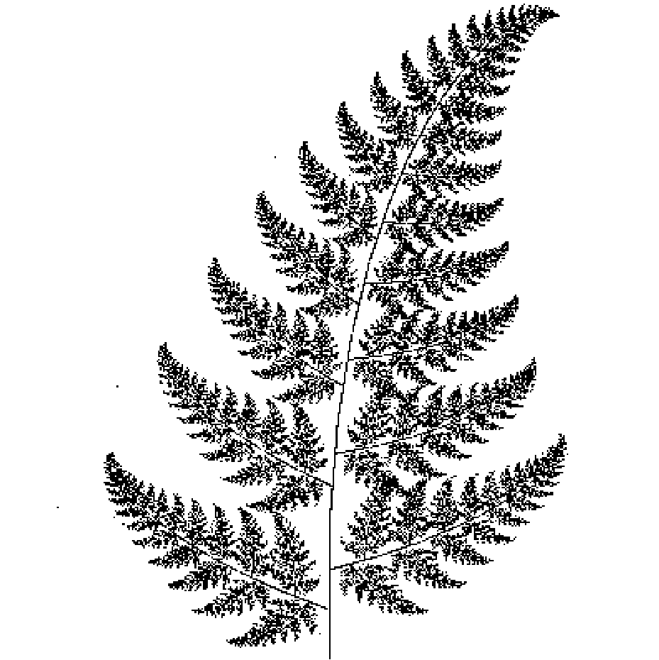

# Assignment 0: Iterated Function Systems


## 1 代码实现


##### IFS类

```c++
class IFS
{
public:
	IFS(int numTransforms, int numPoints, int numIters);

	void SetTransform(int index, float probability, Matrix transform);

	void PerformIFS(char* outputFile, int imageSize);


private:
	int numTransforms;
	Matrix *transforms;
	float *probabilities;
	int numPoints;
	int numIters;

};
```


##### PerformIFS函数

产生随机点并循环按概率施加变换

```c++
	void PerformIFS(char* outputFile, int imageSize)
	{

		srand((unsigned int)(time(NULL)));
		Image outputImage(imageSize, imageSize);
		outputImage.SetAllPixels(Vec3f(1, 1, 1));

		for (int i = 0; i < numPoints; i++)
		{
			Vec2f point((float)rand() / (float)RAND_MAX, (float)rand() / (float)RAND_MAX);
			for (int k = 0; k < numIters; k++)
			{
				Matrix transform;
				float temp = (float)rand() / (float)RAND_MAX;
				float total=0;
				for (int j = 0; j < numTransforms; j++)
				{
					total += probabilities[j];
					if (total >= temp)
					{
						transform = transforms[j];
						break;
					}
				}

				transform.Transform(point);

			}
			
			point.Set(floorf(point[0] * imageSize), floorf(point[1] * imageSize));

			outputImage.SetPixel(point[0], point[1], Vec3f(0, 0, 0));
		}


		if (outputFile != NULL)
			outputImage.SaveTGA(outputFile);
	}
```


## 2 实验结果


```shell
ifs -input sierpinski_triangle.txt -points 10000 -iters 0 -size 200 -output sierpinski_triangle_0.tga
ifs -input sierpinski_triangle.txt -points 10000 -iters 1 -size 200 -output sierpinski_triangle_1.tga
ifs -input sierpinski_triangle.txt -points 10000 -iters 2 -size 200 -output sierpinski_triangle_2.tga
ifs -input sierpinski_triangle.txt -points 10000 -iters 3 -size 200 -output sierpinski_triangle_3.tga
ifs -input sierpinski_triangle.txt -points 10000 -iters 4 -size 200 -output sierpinski_triangle_4.tga
ifs -input sierpinski_triangle.txt -points 10000 -iters 30 -size 200 -output sierpinski_triangle.tga
```













```shell
ifs -input fern.txt -points 50000 -iters 30 -size 400 -output fern.tga
```

