# Assignment 1: Ray Casting

##### 陈九润 3180105488


## 1 代码


##### 1.1 Object3D类

```c++
class Object3D
{

public:
    virtual bool intersect(const Ray& r, Hit& h, float tmin) = 0;

    Object3D(Material* mat) : material(mat) {};
    Object3D() {};
    ~Object3D() {};

    Material* getMaterial()
    {
        return material;
    }

private:
    Material* material;
};

```


##### 1.2 Sphere子类

使用代数法求交点

```c++
class Sphere : public Object3D
{

public:
    Sphere(const Vec3f center, const float radius, Material* mat) : Object3D(mat), center(center), radius(radius) {}
    virtual bool intersect(const Ray& r, Hit& h, float tmin)
    {
        Ray raySphereSpace(r.getOrigin() - center, r.getDirection());
        float disRayOrigin = raySphereSpace.getOrigin().Length();

        float a = raySphereSpace.getDirection().Dot3(raySphereSpace.getDirection());
        float b = 2 * raySphereSpace.getDirection().Dot3(raySphereSpace.getOrigin());
        float c = raySphereSpace.getOrigin().Dot3(raySphereSpace.getOrigin()) - radius * radius;
        float delta = b * b - 4 * a * c;
        if (delta < 0)
        {
            return false;
        }
        delta = sqrtf(delta);
        float t1 = (-b - delta) / (2 * a);
        float t2 = (-b + delta) / (2 * a);
        //cout << "t1:" << t1 << endl;
        //cout << "t2:" << t2 << endl;
        if (t1 > tmin && t1 < h.getT())
        {
            h.set(t1, getMaterial(), r);
            return true;
        }
        else if (t2 > tmin && t2 < h.getT())
        {
            h.set(t2, getMaterial(), r);
            return true;
        }
        return false;
    }

private:
    Vec3f center;
    float radius;
};
```


##### 1.3 Group子类

```c++
class Group : public Object3D {
public:
	Group(){}
	Group(int num)
	{
		objectsNum = num;
		objects.reserve(objectsNum);
	}
	~Group()
	{
		for(int i=0;i<objects.size();i++)
		{
			delete objects[i];
		}
	}
	void addObject(int index, Object3D* obj)
	{
		objects.insert(objects.begin()+index, obj);
	}

	virtual bool intersect(const Ray& r, Hit& h, float tmin)
	{
		bool flag=false;
		for (auto it = objects.begin(); it != objects.end(); it++)
		{
			flag|=(*it)->intersect(r, h, tmin);
		}
		return flag;
		
	}

private:
	int objectsNum;
	vector<Object3D*> objects;

};
```


##### 1.4 Camera类

```c++
class Camera {
public:
	Camera() {}
	Camera(float tmin) :tmin(tmin) {}
	virtual Ray generateRay(Vec2f point) = 0;
	virtual float getTMin() const = 0;
private:
	float tmin;

};
```


##### 1.5 正交相机类

tmin应设为-INFINITY

```c++
class OrthographicCamera : public Camera
{
public:
	OrthographicCamera() : Camera(-INFINITY) {}
	Ray generateRay(Vec2f point)
	{
		float pointX, pointY;
		point.Get(pointX, pointY);

		Vec3f origin = center + (pointX - 0.5) * size * horizontal + (pointY - 0.5) * size * up;
		//cout << "Origin: " << origin<<endl;
		return Ray(origin, direction);
	}

	virtual float getTMin() const
	{
		return tmin;
	}

	OrthographicCamera(Vec3f center, Vec3f direction, Vec3f up, float size) : Camera(-INFINITY), center(center), direction(direction), up(up), size(size)
	{
		this->direction.Normalize();
		this->up = this->up - this->direction * this->up.Dot3(this->direction);
		this->up.Normalize();
		Vec3f::Cross3(this->horizontal, this->direction, this->up);
		this->horizontal.Normalize();
	}

private:
	Vec3f center;
	float size;
	Vec3f horizontal;
	Vec3f up;
	Vec3f direction;
	float tmin;
};
```


##### 1.6 构造Raytracer类

GenerateRayAtIndex函数可以根据当前遍历像素的index构造一个对应的Ray

```c++
class Raytracer
{
public:
    Raytracer()
    {
        assert(0);
    }

    Raytracer(char *input_file, int width, int height, char *output_file, char *depth_file) : input_file(input_file), width(width), height(height), output_file(output_file),depth_file(depth_file)
    {
        scene = new SceneParser(input_file);
        hits= new Hit[width * height];
    }

    void doRaytrace();
    ~Raytracer();

private:
    char *input_file;
    SceneParser *scene;
    char *output_file;
    char *depth_file;
    int width;
    int height;
    Hit* hits;
    float maxT=-INFINITY;
    float minT=INFINITY;


    Ray GenerateRayAtIndex(int index)
    {
        int xindex=index%width;
        int yindex = index / width;
        Vec2f point((float)xindex / (float)(width-1), (float)yindex / (float)(height-1));
        //float d0, d1;
        //point.Get(d0, d1);
        //cout << "pointInfo:" << d0<< " " <<d1<< endl;
        return scene->getCamera()->generateRay(point);
    }

};
```


##### 1.7 doRaytrace()

该函数循环所有像素构造光线并调用group->intersect与场景求交，最后输出颜色值和深度值到文件

```c++
    void doRaytrace()
    {
        Material mat(Vec3f(1, 0, 0));
        for (int i = 0; i < width * height; i++)
        {

            bool hasIntersect =scene->getGroup()->intersect(GenerateRayAtIndex(i), hits[i], scene->getCamera()->getTMin());
            if (!hasIntersect)
            {
                hits[i].setBackgroundMaterial(scene->getBackgroundMaterial());
            }
            float nowT = hits[i].getT();
            if (nowT != INFINITY&&nowT > maxT )
            {
                maxT = nowT;
            }
            if (nowT != INFINITY && nowT < minT)
            {
                minT = nowT;
            }
        }

        Image outputImage(width, height);
        for (int i = 0; i < width * height; i++)
        {
            int x = i % width;
            int y = i / width;
            outputImage.SetPixel(x, y, hits[i].getMaterial()->getDiffuseColor());
        }
        outputImage.SaveTGA(output_file);

        Image depthImage(width, height);
        for (int i = 0; i < width * height; i++)
        {
            int x = i % width;
            int y = i / width;
            //float t = hits[i].getT();
            float t = (maxT - hits[i].getT()) /(maxT-minT);
            //cout << "t " << t << endl;
            Vec3f depthColor(t, t, t);
            depthImage.SetPixel(x, y, depthColor);
        }

        depthImage.SaveTGA(depth_file);

    }
```


## 2 实验结果

```shell
raytracer -input scene1_01.txt -size 200 200 -output output1_01.tga -depth 9 10 depth1_01.tga
```


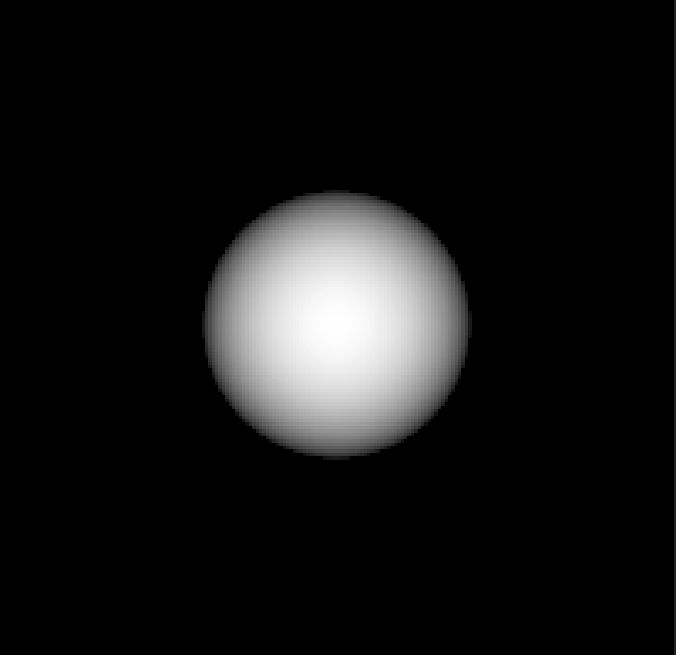


```shell
raytracer -input scene1_02.txt -size 200 200 -output output1_02.tga -depth 8 12 depth1_02.tga
```

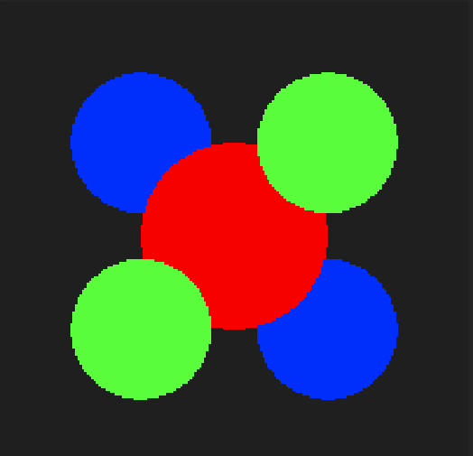

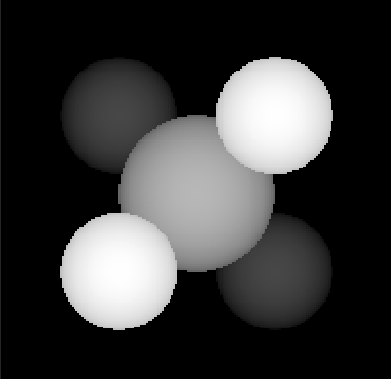


```shell
raytracer -input scene1_03.txt -size 200 200 -output output1_03.tga -depth 8 12 depth1_03.tga
```

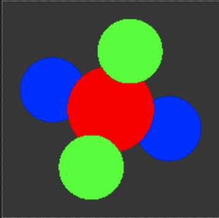

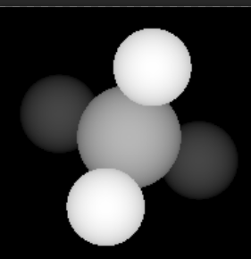


```shell
raytracer -input scene1_04.txt -size 200 200 -output output1_04.tga -depth 12 17 depth1_04.tga
```

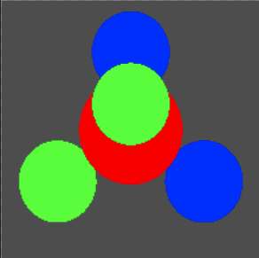

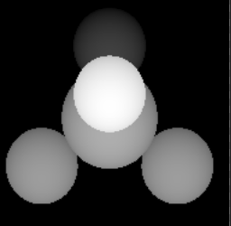


```shell
raytracer -input scene1_05.txt -size 200 200 -output output1_05.tga -depth 14.5 19.5 depth1_05.tga
```

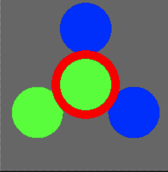

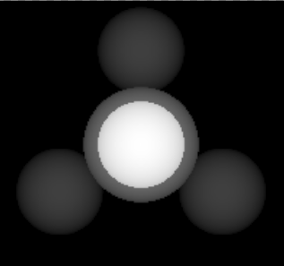


```shell
raytracer -input scene1_06.txt -size 200 200 -output output1_06.tga -depth 3 7 depth1_06.tga
```

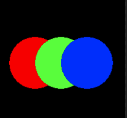

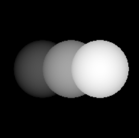


```shell
raytracer -input scene1_07.txt -size 200 200 -output output1_07.tga -depth -2 2 depth1_07.tga 
```

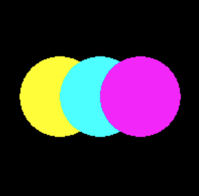

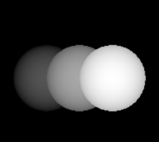

