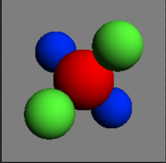
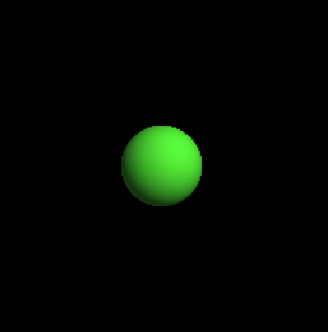
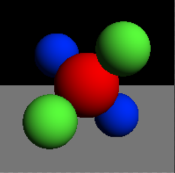
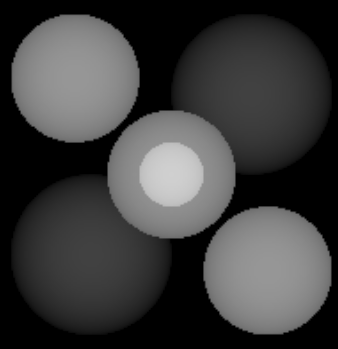

# Assignment 2: Transformations & Additional Primitives

##### 陈九润 3180105488


## 1 代码


### 1.1 修改intersect函数返回法向量

```c++
 virtual bool intersect(const Ray& r, Hit& h, float tmin)
    {
        Ray raySphereSpace(r.getOrigin() - center, r.getDirection());
        float disRayOrigin = raySphereSpace.getOrigin().Length();

        float a = raySphereSpace.getDirection().Dot3(raySphereSpace.getDirection());
        float b = 2 * raySphereSpace.getDirection().Dot3(raySphereSpace.getOrigin());
        float c = raySphereSpace.getOrigin().Dot3(raySphereSpace.getOrigin()) - radius * radius;
        float delta = b * b - 4 * a * c;
        if (delta < 0)
        {
            return false;
        }
        delta = sqrtf(delta);
        float t1 = (-b - delta) / (2 * a);
        float t2 = (-b + delta) / (2 * a);
        Vec3f p1 = r.pointAtParameter(t1);
        Vec3f p2 = r.pointAtParameter(t2);
        Vec3f n1 = p1 - center;
        Vec3f n2 = p2 - center;
        n1.Normalize();
        n2.Normalize();
        if (t1 > tmin )
        {
            if (t1 < h.getT())
            {
                h.set(t1, getMaterial(), n1, r);
                return true;
            }
        }
        else if (t2 > tmin)
        {
            if (t2 < h.getT())
            {
                h.set(t2, getMaterial(), n2, r);
                return true;
            }
        }
        return false;
    }
```


### 1.2 Plane类

```c++
class Plane :public Object3D
{
public: 
	Plane(Vec3f& normal, float d, Material* m):Object3D(m),normal(normal),d(d)
	{
		this->normal.Normalize();
	}

	Plane(Vec3f a, Vec3f b, Vec3f c,Material* m):Object3D(m)
	{
		Vec3f::Cross3(normal, b - a, c - b);
		normal.Normalize();
		d = fabsf(a.Dot3(normal));
	}
	~Plane(){}
	bool intersect(const Ray& r, Hit& h, float tmin)
	{
		if (normal.Dot3(r.getDirection()) == 0)
		{
			return false;
		}

		float t = (d - normal.Dot3(r.getOrigin())) / normal.Dot3(r.getDirection());
		if (t>tmin)
		{
			if (t < h.getT())
			{
				h.set(t, getMaterial(), normal, r);
				return true;
			}
			//return true;
		}
		return false;
	}

private:
	Vec3f normal;
	float d;

};
```


### 1.3 Transform类

```c++
class Transform :public Object3D
{
public:
	Transform(Matrix& m, Object3D* o):transform(m),object(o)
	{
	}
	~Transform()
	{
		delete object;
	}

	virtual bool intersect(const Ray& r, Hit& h, float tmin)
	{
		//cout << "here" << endl;
		//transform ray from world space to object space
		Matrix inverseTransform = transform;
		assert(inverseTransform.Inverse());
		Vec3f rayOriginOS = r.getOrigin();
		Vec3f rayDirectionOS = r.getDirection();

		inverseTransform.Transform(rayOriginOS);
		inverseTransform.TransformDirection(rayDirectionOS);

		float ratio = rayDirectionOS.Length();

		//store the transform ratio
		//float ratio = r.getDirection().x() / rayDirectionOS.x();
		rayDirectionOS.Normalize();
		Ray rayOS(rayOriginOS,rayDirectionOS);

		//do intersect in object space
		Hit temph(h);
		temph.set(h.getT() * ratio, h.getMaterial(), h.getNormal(), rayOS);
		if (!object->intersect(rayOS, temph, tmin*ratio))
		{
			return false;
		}

		//transform normal from object space to world space
		inverseTransform.Transpose();
		Vec3f normalWS = temph.getNormal();
		inverseTransform.TransformDirection(normalWS);
		normalWS.Normalize();
		h.set(temph.getT()/ratio,temph.getMaterial(),normalWS,r);
		return true;
	}

private:
	Matrix transform;
	Object3D* object;

};
```


### 1.4 Triangle类

使用三角形重心坐标系求交

```c++
class Triangle :public Object3D
{
public:
	Triangle(Vec3f& a, Vec3f& b, Vec3f& c, Material* m) :Object3D(m), a(a), b(b), c(c)
	{
		Vec3f::Cross3(normal, b - a, c - b);
		normal.Normalize();
	}
	~Triangle() {};
	bool intersect(const Ray& r, Hit& h, float tmin)
	{
		Vec3f Ro = r.getOrigin();
		Vec3f Rd = r.getDirection();
		float detA = Matrix::det3x3(a.x() - b.x(), a.x() - c.x(), Rd.x(),
						a.y()-b.y(),a.y()-c.y(),Rd.y(),
			a.z() - b.z(), a.z() - c.z(), Rd.z());
		float detBeta= Matrix::det3x3(a.x() - Ro.x(), a.x() - c.x(), Rd.x(),
			a.y() - Ro.y(), a.y() - c.y(), Rd.y(),
			a.z() - Ro.z(), a.z() - c.z(), Rd.z());
		float detGamma = Matrix::det3x3(a.x() - b.x(), a.x() - Ro.x(), Rd.x(),
			a.y() - b.y(), a.y() - Ro.y(), Rd.y(),
			a.z() - b.z(), a.z() - Ro.z(), Rd.z());

		float detT= Matrix::det3x3(a.x() - b.x(), a.x() - c.x(), a.x()-Ro.x(),
			a.y() - b.y(), a.y() - c.y(), a.y()-Ro.y(),
			a.z() - b.z(), a.z() - c.z(), a.z()-Ro.z());

		float beta = detBeta / detA;
		float gamma = detGamma / detA;
		float t = detT / detA;
		if (t > tmin && beta>0 && gamma > 0 && beta + gamma < 1)
		{
			if (t < h.getT())
			{
				h.set(t, getMaterial(), normal, r);
				return true;
			}
			//return true;
		}
		return false;
	}

private:
	Vec3f a;
	Vec3f b;
	Vec3f c;
	Vec3f normal;

};
```


### 1.5 透视相机类

假设virtual screen与center的距离为1，求出其他参数

```c++
class PerspectiveCamera :public Camera
{
public:
	PerspectiveCamera()
	{
		assert(0);
	}
	PerspectiveCamera(Vec3f center, Vec3f& direction, Vec3f& up, float angle):center(center),direction(direction),up(up),angle(angle)
	{
		this->direction.Normalize();
		this->up = this->up - this->direction * this->up.Dot3(this->direction);
		this->up.Normalize();
		Vec3f::Cross3(this->horizontal, this->direction, this->up);
		this->horizontal.Normalize();
		virtualScreenSize = 2 * tanf(angle / (float)2);
		this->tmin = 0;
	}
	~PerspectiveCamera() {}
	Ray generateRay(Vec2f point)
	{
		float pointX, pointY;
		point.Get(pointX, pointY);

		Vec3f rayOrigin = center;
		Vec3f rayDirection = direction+(pointX - 0.5) * virtualScreenSize * horizontal + (pointY - 0.5) * virtualScreenSize * up;
		rayDirection.Normalize();
		//cout << "Origin: " << origin<<endl;
		return Ray(rayOrigin, rayDirection);
	}

	virtual float getTMin() const
	{
		return tmin;
	}


private:
	Vec3f center;
	Vec3f horizontal;
	Vec3f up;
	Vec3f direction;
	float angle;
	float virtualScreenSize;
	float virtualScreenDistance = 1;
	float tmin;

};
```


### 1.6 渲染法向量函数

```c++
    void normalShader(char* outputFile)
    {
        Image outputImage(width, height);
        for (int i = 0; i < width * height; i++)
        {
            int x = i % width;
            int y = i / width;
            Vec3f N = hits[i].getNormal();
            Vec3f depthColor(fabsf(N.x()), fabsf(N.y()), fabsf(N.z()));
            outputImage.SetPixel(x, y, depthColor);
        }
        outputImage.SaveTGA(outputFile);
    }
```


### 1.7 添加diffuse shading

```c++
 void diffuseShader(char* outputFile,bool shadeBack)
    {
        Image outputImage(width, height);
        for (int i = 0; i < width * height; i++)
        {
            int x = i % width;
            int y = i / width;
            if (hits[i].getT() == INFINITY)
            {
                outputImage.SetPixel(x, y, scene->getBackgroundColor());
                continue;
			}
            Vec3f N = hits[i].getNormal();
            //cout << "N: " << N << endl;
            //if shade back
			if (shadeBack && rays[i].getDirection().Dot3(N) > 0)
            {
                N.Negate();
            }
            //no shade back and ray inside object
            if (!shadeBack && rays[i].getDirection().Dot3(N) > 0)
            {
                outputImage.SetPixel(x, y, Vec3f(0,0,0));
                continue;
            }
            Vec3f objectColor = hits[i].getMaterial()->getDiffuseColor();
            Vec3f ambientColor = scene->getAmbientLight() * objectColor;
            Vec3f diffuseColor(0,0,0);
            for (int i = 0; i < scene->getNumLights(); i++)
            {
                Vec3f L;
                Vec3f lightColor;
                scene->getLight(i)->getIllumination(hits[i].getIntersectionPoint(), L, lightColor);
                float temp = L.Dot3(N);
                if (temp < 0)
                    temp = 0;
                diffuseColor += temp * lightColor * objectColor;
            }
            Vec3f pixelColor =ambientColor+diffuseColor;
            outputImage.SetPixel(x, y, pixelColor);
        }
        outputImage.SaveTGA(outputFile);
    }
```


## 2 实验结果

```shell
raytracer -input scene2_01_diffuse.txt -size 200 200 -output output2_01.tga
raytracer -input scene2_02_ambient.txt -size 200 200 -output output2_02.tga
```


```
raytracer -input scene2_03_colored_lights.txt -size 200 200 -output output2_03.tga -normals normals2_03.tga
```


```shell
raytracer -input scene2_04_perspective.txt -size 200 200 -output output2_04.tga -normals normals2_04.tga
```




```shell
raytracer -input scene2_05_inside_sphere.txt -size 200 200 -output output2_05.tga -depth 9 11 depth2_05.tga -normals normals2_05.tga -shade_back
raytracer -input scene2_05_inside_sphere.txt -size 200 200 -output output2_05_no_back.tga
```





```shell
raytracer -input scene2_06_plane.txt -size 200 200 -output output2_06.tga -depth 8 20 depth2_06.tga -normals normals2_06.tga
```




```
raytracer -input scene2_07_sphere_triangles.txt -size 200 200 -output output2_07.tga -depth 9 11 depth2_07.tga -normals normals2_07.tga -shade_back
raytracer -input scene2_07_sphere_triangles.txt -size 200 200 -output output2_07_no_back.tga
```


```shell
raytracer -input scene2_08_cube.txt -size 200 200 -output output2_08.tga
raytracer -input scene2_09_bunny_200.txt -size 200 200 -output output2_09.tga
raytracer -input scene2_10_bunny_1k.txt -size 200 200 -output output2_10.tga
```


```
raytracer -input scene2_11_squashed_sphere.txt -size 200 200 -output output2_11.tga -normals normals2_11.tga
```


```shell
raytracer -input scene2_12_rotated_sphere.txt -size 200 200 -output output2_12.tga -normals normals2_12.tga
```


```shell
raytracer -input scene2_13_rotated_squashed_sphere.txt -size 200 200 -output output2_13.tga -normals normals2_13.tga
```


```shell
raytracer -input scene2_14_axes_cube.txt -size 200 200 -output output2_14.tga
raytracer -input scene2_15_crazy_transforms.txt -size 200 200 -output output2_15.tga
```


```shell
raytracer -input scene2_16_t_scale.txt -size 200 200 -output output2_16.tga -depth 2 7 depth2_16.tga
```


