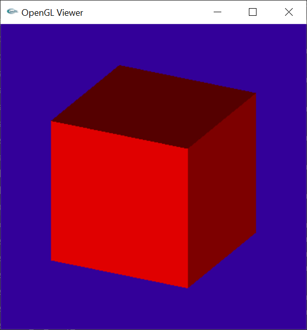

# Assignment 3: OpenGL & Phong Shading


## 1 代码实现


### 1.1 主函数增加glCanvas调用

```c++
//previsualize this scene with OpenGL
	raytracer = new Raytracer(input_file, width, height, depth_min, depth_max);
	if (previsualize)
	{
		//glewInit();
		//glutInit(&argc, argv);
		GLCanvas glCanvas;
		glCanvas.initialize(raytracer->getScene(), shade);
	}
	else
	{
		shade();
	}
```


### 1.2 增加Camera类函数以操纵OpenGL相机

```c++
	void glPlaceCamera(void)
	{
		gluLookAt(center.x(), center.y(), center.z(), center.x() + direction.x(), center.y() + direction.y(), center.z() + direction.z(), up.x(), up.y(), up.z());
	}
	void truckCamera(float dx, float dy)
	{
		center += horizontal * dx + up * dy;
	}

	void rotateCamera(float rx, float ry)
	{
		float tiltAngle = acos(up.Dot3(direction));
		if (tiltAngle - ry > 3.13)
			ry = tiltAngle - 3.13;
		else if (tiltAngle - ry < 0.01)
			ry = tiltAngle - 0.01;
		Matrix rotMat = Matrix::MakeAxisRotation(up, rx);
		rotMat *= Matrix::MakeAxisRotation(horizontal, ry);
		rotMat.Transform(center);
		rotMat.TransformDirection(direction);


		this->direction.Normalize();
		this->up = this->up - this->direction * this->up.Dot3(this->direction);
		this->up.Normalize();
		Vec3f::Cross3(this->horizontal, this->direction, this->up);
		this->horizontal.Normalize();

	}
```


### 1.3 Phongmaterial

```c++
class PhongMaterial : public Material {
public:
	PhongMaterial(const Vec3f& diffuseColor, const Vec3f& specularColor, float exponent) :Material(diffuseColor), specularColor(specularColor), exponent(exponent)
	{}
	virtual Vec3f Shade(const Ray& ray, const Hit& hit, const Vec3f& dirToLight, const Vec3f& lightColor) const
	{
        Vec3f normal = hit.getNormal();
        Vec3f dirToView = ray.getDirection();
        dirToView.Negate();
        Vec3f h = dirToView + dirToLight;
        h.Normalize();
        float cosBeta = normal.Dot3(h);
        if (normal.Dot3(dirToLight)< 0)
        {
            cosBeta = 0;
        }
        //ignore r^2 and ks
        Vec3f specularComponent=powf(cosBeta, exponent)* lightColor*specularColor;
        float cosTheta = normal.Dot3(dirToLight);
        if (cosTheta < 0)
        {
            cosTheta = 0;
        }
        Vec3f diffuseComponent = cosTheta * lightColor * diffuseColor;
        //no ambientComponent
        return specularComponent + diffuseComponent;
	}
```


### 1.4 对Object3D子类增加Paint函数

##### Sphere

将球面绘制为大量三角形面

```c++
void paint(void)
    {
        extern int thetaSteps;
        extern int phiSteps;
        extern bool gouraudShading;

        float thetaStepLength=(float)2*M_PI/thetaSteps;
        float phiStepLength=(float)M_PI/phiSteps;

        
        getMaterial()->glSetMaterial();
        glBegin(GL_QUADS);
        for (float iPhi = 0; iPhi < M_PI; iPhi += phiStepLength)
        {
            for (float iTheta = 0; iTheta < 2*M_PI; iTheta += thetaStepLength) 
            {
                Vec3f points[4];
                points[0].Set(radius * sinf(iPhi) * cosf(iTheta), radius * sinf(iPhi) * sinf(iTheta), radius * cosf(iPhi));
                points[1].Set(radius * sinf(iPhi) * cosf(iTheta + thetaStepLength), radius * sinf(iPhi) * sinf(iTheta + thetaStepLength), radius * cosf(iPhi));
                points[2].Set(radius * sinf(iPhi + phiStepLength) * cosf(iTheta + thetaStepLength), radius * sinf(iPhi + phiStepLength) * sinf(iTheta + thetaStepLength), radius * cosf(iPhi + phiStepLength));
                points[3].Set(radius * sinf(iPhi + phiStepLength) * cosf(iTheta), radius * sinf(iPhi + phiStepLength) * sinf(iTheta), radius * cosf(iPhi + phiStepLength));

                //Gouraund interpolation
                if (gouraudShading)
                {
                    Vec3f normali;
                    for (int i = 0; i < 4; i++)
                    {
                        normali = points[i];
                        normali.Normalize();
                        glNormal3f(normali.x(), normali.y(), normali.z());
                        points[i] += center;
                        glVertex3f(points[i].x(), points[i].y(), points[i].z());
                    }
                }
                //flat shading 
                else 
                {
                    Vec3f line1;
                    Vec3f line2;
                    if (iPhi < M_PI / 2)
                    {
                        line1 = points[2] - points[1];
                        line2 = points[3] - points[2];
                    }
                    else
                    {
                        line1 = points[1] - points[0];
                        line2 = points[2] - points[1];
                    }
             
                    Vec3f flatNormal;
                    Vec3f::Cross3(flatNormal, line2, line1);
                    flatNormal.Normalize();
                    glNormal3f(flatNormal.x(), flatNormal.y(), flatNormal.z());
                    for (int i = 0; i < 4; i++)
                    {
                        points[i] += center;
                        glVertex3f(points[i].x(), points[i].y(), points[i].z());
                    }

                }
               

                
            }
        }
        glEnd();
    }
```


##### Triangle

```c++
	virtual void paint(void)
	{
		getMaterial()->glSetMaterial();
		glBegin(GL_TRIANGLES);
		glNormal3f(normal.x(), normal.y(), normal.z());
		glVertex3f(a.x(), a.y(), a.z());
		glVertex3f(b.x(), b.y(), b.z());
		glVertex3f(c.x(), c.y(), c.z());
		glEnd();
	}
```


##### Plane

```c++
	void paint(void)
	{
		//origin projection on the plane
		//true whether d is positive or negative
		Vec3f o=normal*d;
		
		Vec3f v;
		//parellel
		if (normal.Dot3(Vec3f(1, 0, 0))<1)
		{
			v.Set(1, 0, 0);
		}
		else
		{
			v.Set(0, 1, 0);
		}

		Vec3f basis1;
		Vec3f::Cross3(basis1, v, normal);
		basis1.Normalize();
		Vec3f basis2;
		Vec3f::Cross3(basis2, normal, basis1);
		basis2.Normalize();

		Vec3f points[4];
		points[0] = o + basis1 * LENGTH;
		points[1] = o + basis2 * LENGTH;
		points[2] = o - basis1 * LENGTH;
		points[3] = o - basis2 * LENGTH;

		getMaterial()->glSetMaterial();
		glBegin(GL_QUADS);
		glNormal3f(normal.x(), normal.y(), normal.z());
		glVertex3f(points[0].x(), points[0].y(), points[0].z());
		glVertex3f(points[1].x(), points[1].y(), points[1].z());
		glVertex3f(points[2].x(), points[2].y(), points[2].z());
		glVertex3f(points[3].x(), points[3].y(), points[3].z());
		glEnd();
	}
```


##### Transform

```c++
	virtual void paint(void)
	{
		glPushMatrix();
		GLfloat* glMatrix = transform.glGet();
		glMultMatrixf(glMatrix);
		delete[] glMatrix;
		object->paint();
		glPopMatrix();
	}

```


##### Group

```c++
	virtual void paint(void)
	{
		for (auto it = objects.begin(); it != objects.end(); it++)
		{
			(*it)->paint();
		}
	}
```


## 2 实验结果

```shell
raytracer -input scene3_01_cube_orthographic.txt -size 200 200 -output output3_01.tga -gui
```




```shell
raytracer -input scene3_02_cube_perspective.txt -size 200 200 -output output3_02.tga -gui
```


```shell
raytracer -input scene3_03_bunny_mesh_200.txt -size 200 200 -output output3_03.tga -gui
```


```shell
raytracer -input scene3_04_bunny_mesh_1k.txt -size 200 200 -output output3_04.tga -gui
```


```shell
raytracer -input scene3_05_axes_cube.txt -size 200 200 -output output3_05.tga -gui
```


```shell
raytracer -input scene3_06_crazy_transforms.txt -size 200 200 -output output3_06.tga -gui
```


```shell
raytracer -input scene3_07_plane.txt -size 200 200 -output output3_07.tga -gui -tessellation 10 5
```


```shell
raytracer -input scene3_08_sphere.txt -size 200 200 -output output3_08.tga -gui -tessellation 10 5
raytracer -input scene3_08_sphere.txt -size 200 200 -output output3_08.tga -gui -tessellation 20 10
raytracer -input scene3_08_sphere.txt -size 200 200 -output output3_08.tga -gui -tessellation 10 5 -gouraud
raytracer -input scene3_08_sphere.txt -size 200 200 -output output3_08.tga -gui -tessellation 20 10 -gouraud
```


```shell
raytracer -input scene3_09_exponent_variations.txt -size 300 300 -output output3_09.tga -gui -tessellation 100 50 -gouraud
```


```shell
raytracer -input scene3_10_exponent_variations_back.txt -size 300 300 -output output3_10.tga -gui -tessellation 100 50 -gouraud 
```


```shell
raytracer -input scene3_11_weird_lighting_diffuse.txt -size 200 200 -output output3_11.tga -gui -tessellation 100 50 -gouraud
```


```shell
raytracer -input scene3_12_weird_lighting_specular.txt -size 200 200 -output output3_12.tga -gui -tessellation 100 50 -gouraud
```


