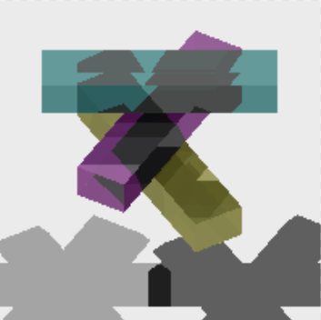
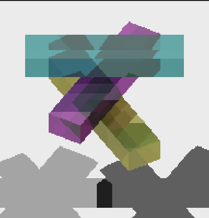

# Assignment 4: Shadows, Reflection & Refraction


## 1 代码实现


### 1.1 修改Phongmaterial

```c++
class PhongMaterial : public Material {
public:

    PhongMaterial(const Vec3f& diffuseColor, const Vec3f& specularColor, float exponent) :Material(diffuseColor), specularColor(specularColor), exponent(exponent)
    {}

    PhongMaterial(const Vec3f& diffuseColor,
        const Vec3f& specularColor,
        float exponent,
        const Vec3f& reflectiveColor,
        const Vec3f& transparentColor,
        float indexOfRefraction):Material(diffuseColor), specularColor(specularColor), exponent(exponent),
        reflectiveColor(reflectiveColor),transparentColor(transparentColor),indexOfRefraction(indexOfRefraction)
    {}

    Vec3f getSpecularColor() const { return specularColor; }
    Vec3f getReflectiveColor() const { return reflectiveColor; }
    Vec3f getTransparentColor() const { return transparentColor; }
    float getIndexOfRefraction() const { return indexOfRefraction; }


	virtual Vec3f Shade(const Ray& ray, const Hit& hit, const Vec3f& dirToLight, const Vec3f& lightColor) const
	{
        Vec3f normal = hit.getNormal();
        Vec3f dirToView = ray.getDirection();
        dirToView.Negate();
        Vec3f h = dirToView + dirToLight;
        h.Normalize();
        float cosBeta = normal.Dot3(h);
        if (normal.Dot3(dirToLight)< 0)
        {
            cosBeta = 0;
        }
        //ignore r^2 and ks
        Vec3f specularComponent=powf(cosBeta, exponent)* lightColor*specularColor;


        float cosTheta = normal.Dot3(dirToLight);
        if (cosTheta < 0)
        {
            cosTheta = 0;
        }
        Vec3f diffuseComponent = cosTheta * lightColor * diffuseColor;

        //no ambientComponent

        return specularComponent + diffuseComponent;


	}
```


### 1.2 构造RayTracer类

raytraceShader函数在每个像素位置生成光线并调用traceRay函数实现光线追踪

mirrorDirection函数计算反射方向

transmittedDirection函数计算折射方向

```c++
class RayTracer
{
public:

    //Assignment4
    RayTracer(char* input_file, int width, int height, int max_bounces, float cutoff_weight, bool shadows, bool shadeback) : 
        input_file(input_file), width(width), height(height), maxBounces(max_bounces), cutoffWeight(cutoff_weight), shadeShadows(shadows),shadeBack(shadeback)
    {
        scene = new SceneParser(input_file);
        hits = new Hit[width * height];
        rays = new Ray[width * height];
        assert(scene != NULL);
        ambientLight = scene->getAmbientLight();
    }

    ~RayTracer()
    {
        delete scene;
        delete[] hits;
    }


    //Assignment4
    void raytraceShader(char* outputFile)
    {
        Image outputImage(width, height);
        for (int i = 0; i < width * height; i++)
        {
            int x = i % width;
            int y = i / width;
            Hit hit;
            Ray ray = generateRayAtIndex(i);
            outputImage.SetPixel(x, y, traceRay(ray, scene->getCamera()->getTMin(), 0, 1, VACUUM_REFRACTION_INDEX, hit));
        }
        outputImage.SaveTGA(outputFile);
    }


    Vec3f traceRay(Ray& ray, float tmin, int bounces, float weight,
        float indexOfRefraction, Hit& hit) const;

private:
    char *input_file;
    SceneParser *scene;
    Ray* rays;
    int width;
    int height;
    Hit* hits;
    float depth_min;
    float depth_max;
    //GLCanvas *glCanvas;

    //Assignment4
    int maxBounces;
    float cutoffWeight;
    bool shadeShadows;
    bool shadeBack;
    Vec3f ambientLight;


    Ray generateRayAtIndex(int index);
    //Assignment4
    Vec3f mirrorDirection(const Vec3f& normal, const Vec3f& incoming) const;

    bool transmittedDirection(const Vec3f& normal, const Vec3f& incoming,
        float index_i, float index_t, Vec3f& transmitted) const;


};
```


### 1.3 traceRay函数实现

首先明确递归出口，超过最大追踪次数或权重过小

随后跟场景求交

将最终返回颜色分为ambientColor ， diffuseSpecularColor， relectColor， refractColor四部分，分别进行计算，最后加和

```c++
Vec3f traceRay(Ray& ray, float tmin, int bounces, float weight,
        float indexOfRefraction, Hit& hit) const
    {
        if (bounces > maxBounces || weight < cutoffWeight)
        {
            return Vec3f(0, 0, 0);
        }

        scene->getGroup()->intersect(ray, hit, tmin);
        //render main segment
        if (bounces == 0)
        {
            RayTree::SetMainSegment(ray, tmin, hit.getT());
        }
        //no intersection
        if (hit.getT() == INFINITY)
        {
            return weight * scene->getBackgroundColor();
        }

        Vec3f normal = hit.getNormal();
        //shade back and ray inside object
        if (shadeBack && ray.getDirection().Dot3(normal) > 0)
        {
            normal.Negate();
        }

        //no shade back and ray inside object
        if (!shadeBack && ray.getDirection().Dot3(normal) > 0)
        {
            return Vec3f(0, 0, 0);
        }

        Vec3f objectColor = hit.getMaterial()->getDiffuseColor();
        Vec3f ambientColor = ambientLight * objectColor;
        Vec3f diffuseSpecularColor(0, 0, 0);
		//calculate shadow code

        //deal with reflection color
        Vec3f reflectColor = hit.getMaterial()->getReflectiveColor();
		//calculate reflact color code

        //deal with refraction color
        Vec3f refractColor = hit.getMaterial()->getTransparentColor();
		//calculate refract color code

        Vec3f resultColor = refractColor + reflectColor + diffuseSpecularColor + ambientColor;
        return weight * resultColor;
    }
```


##### diffuseSpecularColor部分考虑阴影，阴影的处理如下：

若射向光源的光线被阻挡，则该光源的部分不加入结果

```c++
 Vec3f objectColor = hit.getMaterial()->getDiffuseColor();
        Vec3f ambientColor = ambientLight * objectColor;
        Vec3f diffuseSpecularColor(0, 0, 0);
for (int j = 0; j < scene->getNumLights(); j++)
        {
            Vec3f dirToLight;
            Vec3f lightColor;
            float distanceToLight;
            scene->getLight(j)->getIllumination(hit.getIntersectionPoint(), dirToLight, lightColor, distanceToLight);
            if (!shadeShadows)
            {
                diffuseSpecularColor += hit.getMaterial()->Shade(hit.getRay(), hit, dirToLight, lightColor);
                continue;
            }

            //shade shadows
            Ray shadowRay(hit.getIntersectionPoint(), dirToLight);
            RayTree::AddShadowSegment(shadowRay, 0, distanceToLight);
            if (!scene->getGroup()->intersectShadowRay(shadowRay, EPSILON,distanceToLight))
            {
                diffuseSpecularColor += hit.getMaterial()->Shade(hit.getRay(), hit, dirToLight, lightColor);
            }

        }
```

通过对每个Object3D类子类编写intersectShadowRay函数实现快速阴影光线求交:

一旦有交点则返回true，无需寻找最近交点，但要注意交点的t值要小于到光源的距离才为有效阻挡

以sphere为例：

```c++
virtual bool intersectShadowRay(const Ray& r, float tmin,float distanceToLight)
    {
        //cout << "Sphere center: " << this->center << endl;
        Ray raySphereSpace(r.getOrigin() - center, r.getDirection());
        float disRayOrigin = raySphereSpace.getOrigin().Length();

        float a = raySphereSpace.getDirection().Dot3(raySphereSpace.getDirection());
        float b = 2 * raySphereSpace.getDirection().Dot3(raySphereSpace.getOrigin());
        float c = raySphereSpace.getOrigin().Dot3(raySphereSpace.getOrigin()) - radius * radius;
        float delta = b * b - 4 * a * c;
        if (delta < 0)
        {
            return false;
        }
        delta = sqrtf(delta);
        float t1 = (-b - delta) / (2 * a);
        float t2 = (-b + delta) / (2 * a);
        Vec3f p1 = r.pointAtParameter(t1);
        Vec3f p2 = r.pointAtParameter(t2);
        Vec3f n1 = p1 - center;
        Vec3f n2 = p2 - center;
        n1.Normalize();
        n2.Normalize();
        if (t1 > tmin && t1 <= distanceToLight )
        {
            return true;
        }
        else if (t2 > tmin && t2 <= distanceToLight)
        {
            return true;
        }
        return false;
    }
```


##### 反射光线部分：

生成反射光线并递归调用

```c++
      //deal with reflection color
        Vec3f reflectColor = hit.getMaterial()->getReflectiveColor();
        if (reflectColor != Vec3f(0, 0, 0))
        {
            Ray reflectRay(hit.getIntersectionPoint(), mirrorDirection(normal, ray.getDirection()));
            Hit reflectHit;
            Vec3f reflectResult = traceRay(reflectRay, EPSILON, bounces + 1, weight- WEIGHT_STEP_DECREASE, indexOfRefraction, reflectHit);
            reflectColor = reflectColor * reflectResult;
            RayTree::AddReflectedSegment(reflectRay, 0, reflectHit.getT());
        }
```


##### 折射光线部分：

构造折射光线，并递归调用

注意考虑入射光线来自真空或物体内两种情况

```c++
 //deal with refraction color
        Vec3f refractColor = hit.getMaterial()->getTransparentColor();
        if (refractColor != Vec3f(0, 0, 0))
        {
            Vec3f refractDirection;
            Vec3f refractResult;
            //ray from inside object
            if (ray.getDirection().Dot3(hit.getNormal()) > 0)
            {
                transmittedDirection(normal, ray.getDirection(), indexOfRefraction, VACUUM_REFRACTION_INDEX, refractDirection);
                Ray refractRay(hit.getIntersectionPoint(), refractDirection);
                Hit refractHit;
                refractResult = traceRay(refractRay, EPSILON, bounces + 1, weight- WEIGHT_STEP_DECREASE, VACUUM_REFRACTION_INDEX, refractHit);
                RayTree::AddTransmittedSegment(refractRay, 0, refractHit.getT());

            }
            //ray from outside object
            else
            {
                transmittedDirection(normal, ray.getDirection(), indexOfRefraction, hit.getMaterial()->getIndexOfRefraction(), refractDirection);
                Ray refractRay(hit.getIntersectionPoint(), refractDirection);
                Hit refractHit;
                refractResult = traceRay(refractRay, EPSILON, bounces + 1, weight- WEIGHT_STEP_DECREASE, hit.getMaterial()->getIndexOfRefraction(), refractHit);
                RayTree::AddTransmittedSegment(refractRay, 0, refractHit.getT());
            }
            refractColor = refractColor * refractResult;

        }
```


### 1.4 加入RayTree相关函数

便于进行debug和观察效果，代码略


## 2 实验结果


```shell
raytracer -input scene4_01_sphere_shadow.txt -size 200 200 -output output4_01.tga -shadows 
```


```c++
raytracer -input scene4_02_colored_shadows.txt -size 200 200 -output output4_02.tga -shadows -gui -tessellation 50 25 -gouraud
```


```shell
raytracer -input scene4_03_mirrored_floor.txt -size 200 200 -output output4_03.tga -shadows -bounces 1 -weight 0.01 -gui
```


```c++
raytracer -input scene4_04_reflective_sphere.txt -size 200 200 -output output4_04a.tga -shadows -bounces 0 -weight 0.01
raytracer -input scene4_04_reflective_sphere.txt -size 200 200 -output output4_04b.tga -shadows -bounces 1 -weight 0.01
raytracer -input scene4_04_reflective_sphere.txt -size 200 200 -output output4_04c.tga -shadows -bounces 2 -weight 0.01
raytracer -input scene4_04_reflective_sphere.txt -size 200 200 -output output4_04d.tga
```


```shell
raytracer -input scene4_05_transparent_bar.txt -size 200 200 -output output4_05.tga -shadows -bounces 10 -weight 0.01 -shade_back -gui
```


```shell
raytracer -input scene4_06_transparent_bars.txt -size 200 200 -output output4_06a.tga -shadows -bounces 0 -weight 0.01 -shade_back -gui
raytracer -input scene4_06_transparent_bars.txt -size 200 200 -output output4_06b.tga -shadows -bounces 1 -weight 0.01 -shade_back -gui
raytracer -input scene4_06_transparent_bars.txt -size 200 200 -output output4_06c.tga -shadows -bounces 2 -weight 0.01 -shade_back -gui
raytracer -input scene4_06_transparent_bars.txt -size 200 200 -output output4_06d.tga -shadows -bounces 3 -weight 0.01 -shade_back -gui
raytracer -input scene4_06_transparent_bars.txt -size 200 200 -output output4_06e.tga -shadows -bounces 4 -weight 0.01 -shade_back -gui
raytracer -input scene4_06_transparent_bars.txt -size 200 200 -output output4_06f.tga -shadows -bounces 5 -weight 0.01 -shade_back -gui
```







```shell
raytracer -input scene4_07_transparent_sphere_1.0.txt -size 200 200 -output output4_07.tga -shadows -bounces 5 -weight 0.01 -shade_back -gui -tessellation 30 15
raytracer -input scene4_08_transparent_sphere_1.1.txt -size 200 200 -output output4_08.tga -shadows -bounces 5 -weight 0.01 -shade_back -gui -tessellation 30 15
raytracer -input scene4_09_transparent_sphere_2.0.txt -size 200 200 -output output4_09.tga -shadows -bounces 5 -weight 0.01 -shade_back -gui -tessellation 30 15
```


```shell
raytracer -input scene4_10_point_light_distance.txt -size 200 200 -output output4_10.tga -shadows -gui
```


```shell
raytracer -input scene4_11_point_light_circle.txt -size 200 200 -output output4_11.tga -shadows 
raytracer -input scene4_12_point_light_circle_d_attenuation.txt -size 200 200 -output output4_12.tga -shadows 
raytracer -input scene4_13_point_light_circle_d2_attenuation.txt -size 200 200 -output output4_13.tga -shadows 
```


```shell
raytracer -input scene4_14_faceted_gem.txt -size 200 200 -output output4_14a.tga -shadows -shade_back -bounces 0 -weight 0.01 
raytracer -input scene4_14_faceted_gem.txt -size 200 200 -output output4_14b.tga -shadows -shade_back -bounces 1 -weight 0.01 
raytracer -input scene4_14_faceted_gem.txt -size 200 200 -output output4_14c.tga -shadows -shade_back -bounces 2 -weight 0.01 
raytracer -input scene4_14_faceted_gem.txt -size 200 200 -output output4_14d.tga -shadows -shade_back -bounces 3 -weight 0.01 
raytracer -input scene4_14_faceted_gem.txt -size 200 200 -output output4_14e.tga -shadows -shade_back -bounces 4 -weight 0.01 
raytracer -input scene4_14_faceted_gem.txt -size 200 200 -output output4_14f.tga -shadows -shade_back -bounces 5 -weight 0.01 
```


```shell
raytracer -input scene4_14_faceted_gem.txt -size 200 200 -shadows -shade_back -bounces 1 -weight 0.01 -gui
raytracer -input scene4_14_faceted_gem.txt -size 200 200 -shadows -shade_back -bounces 2 -weight 0.01 -gui
raytracer -input scene4_14_faceted_gem.txt -size 200 200 -shadows -shade_back -bounces 3 -weight 0.01 -gui
```


