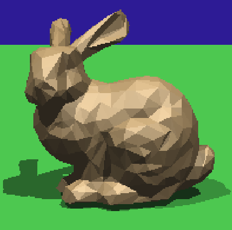
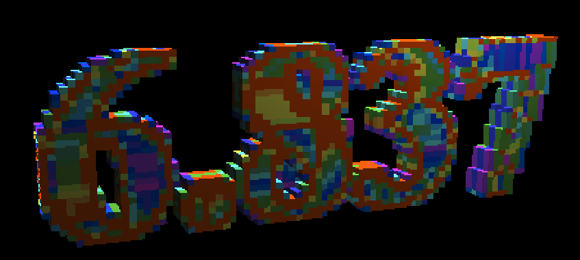

# Assignment 6: Grid Acceleration & Solid Textures


## 1 代码实现


### 1.1 增加RayTracingStats函数计算性能

代码略


### 1.2 实现光线与Grid中物体求交函数

在该函数中，首先调用initializeRayMarch函数得到最初交点，然后使用Ray Marching in Grid算法遍历每个经过的Voxel，当Voxel中有object时便用光线与该object求交，并判断交点t值是否在该voxel内，若交点在voxel内则迭代结束

同时，由于平面等无限object无法加入grid中，还要将光线与场景中的平面求交，场景中的平面存储在infiniteObjects数组，先将光线与平面求交，再进行Grid与光线求交，通过对比平面相交的t值和当前voxel的t值可以提前结束迭代，是一个小优化

同时，通过一个std::map hitmap存储object和光线的求交结果，可以避免对物体的重复求交

```c++
	//Assignment6

	//intersect with objects
	bool intersectObjects(const Ray& r, Hit& h, float tmin)
	{
		//avoid duplicate ray-primitive intersections for objects that overlap multiple cells
	std:map<Object3D*, Hit> hitmap;

		bool state = false;
		//intersect the ray with infinite objects first
		for (int i = 0; i < infiniteObjects.getNumObjects(); i++)
		{
			state|=infiniteObjects.getObject(i)->intersect(r, h, tmin);
		}

		//intersect the ray with gird
		MarchingInfo mi;
		initializeRayMarch(mi, r, tmin);
		//no intersection with the grid
		if (mi.getTmin() == INFINITY)
		{
			return state;
		}

		int i, j, k;
		mi.getGridIndex(i, j, k);
		//walk through each voxel along the ray
		while (i >= 0 && i < nx && j >= 0 && j < ny && k >= 0 && k < nz)
		{
			RayTracingStats::IncrementNumGridCellsTraversed();
			float voxelTmax = mi.getCurrentVoxelTmax();
			int numObjects = voxels[i][j][k].getNumObjects();
			if (numObjects != 0)
			{
				Hit temph(h);
				for (int o = 0; o < numObjects; o++)
				{
					Object3D* obj = voxels[i][j][k].getObject(o);
					
					//avoid duplicate ray-primitive intersections for objects that overlap multiple cells
					if (hitmap.count(obj)==0)
					{
						obj->intersect(r, temph, tmin);
						hitmap[obj] = temph;
					}
					else
					{
						if (hitmap[obj].getT() < temph.getT())
						{
							temph.set(hitmap[obj]);
						}
					}
				}

				if (temph.getT() <= voxelTmax+GRID_EPSILON)
				{
					h.set(temph);
					return true;
				}
				//early stop
				if (voxelTmax-GRID_EPSILON > h.getT())
				{
					return state;
				}

			}
			mi.nextCell();
			mi.getGridIndex(i, j, k);
		}

		return state;

	}
```


与阴影光线求交的intersectObjectShadow函数与上个函数类似，只是与物体求交调用intersectShadowRay函数进行快速求交

```c++
//intersect objects with shadow rays
	bool intersectObjectsShadow(const Ray& r, float tmin, float distanceToLight)
	{
		//intersect with finite objects
		for (int i = 0; i < infiniteObjects.getNumObjects(); i++)
		{
			if (infiniteObjects.getObject(i)->intersectShadowRay(r, tmin, distanceToLight))
			{
				return true;
			}
		}
		MarchingInfo mi;
		initializeRayMarch(mi, r, tmin);
		if (mi.getTmin() == INFINITY)
		{
			return false;
		}

		int i, j, k;
		mi.getGridIndex(i, j, k);
		//walk through each voxel along the ray
		while (i >= 0 && i < nx && j >= 0 && j < ny && k >= 0 && k < nz)
		{
			RayTracingStats::IncrementNumGridCellsTraversed();
			//float voxelTmax = mi.getCurrentVoxelTmax();
			int numObjects = voxels[i][j][k].getNumObjects();
			if (numObjects != 0)
			{
				for (int o = 0; o < numObjects; o++)
				{
					if (voxels[i][j][k].getObject(o)->intersectShadowRay(r, tmin, distanceToLight))
					{
						return true;
					}
				}

			}
			mi.nextCell();
			mi.getGridIndex(i, j, k);
		}

		return false;
	}
```


### 1.3 实现快慢两种RayCast函数

RayCast函数调用traceRay函数进行光线追踪，其内部调用group->intersect与场景求交

RayCastFast函数调用traceRayFast函数进行光线追踪，其内部调用grid->intersectObjects函数借助grid与场景求交，以此加速

二者其他部分基本相同

```c++
//Assignment6
void RayCast(char* outputFile)
{
    Image outputImage(width, height);
    int xoffset = 0;
    int yoffset = 0;

    //deal with width!=height
    if (width > height)
    {
        yoffset = (squareLength - height) / 2;
    }
    else if (width < height)
    {
        xoffset = (squareLength - width) / 2;
    }

    for (int i = 0; i < width * height; i++)
    {
        int x = i % width;
        int y = i / width;
        int xrayIndex = x + xoffset;
        int yrayIndex = y + yoffset;
        Hit hit;
        Ray ray = generateRayAtIndex(xrayIndex, yrayIndex);
        RayTracingStats::IncrementNumNonShadowRays();
        outputImage.SetPixel(x, y, traceRay(ray, scene->getCamera()->getTMin(), 0, 1, VACUUM_REFRACTION_INDEX, hit));
    }
    outputImage.SaveTGA(outputFile);
}

void RayCastFast(char* outputFile)
{
    Image outputImage(width, height);
    int xoffset = 0;
    int yoffset = 0;

    //deal with width!=height
    if (width > height)
    {
        yoffset = (squareLength - height) / 2;
    }
    else if (width < height)
    {
        xoffset = (squareLength - width) / 2;
    }

    for (int i = 0; i < width * height; i++)
    {
        int x = i % width;
        int y = i / width;
        int xrayIndex = x + xoffset;
        int yrayIndex = y + yoffset;

        Hit hit;
        Ray ray = generateRayAtIndex(xrayIndex, yrayIndex);
        RayTracingStats::IncrementNumNonShadowRays();
        outputImage.SetPixel(x, y, traceRayFast(ray, scene->getCamera()->getTMin(), 0, 1, VACUUM_REFRACTION_INDEX, hit));
    }
    outputImage.SaveTGA(outputFile);
}
```


### 1.4 CheckBoard类

```c++
class Checkerboard :public Material
{
public:
    Checkerboard(Matrix* m, Material* mat1, Material* mat2):matrix(m),material1(mat1),material2(mat2)
    {

    }

    void glSetMaterial(void) const
    {
        material1->glSetMaterial();
    }


    virtual Vec3f Shade(const Ray& ray, const Hit& hit, const Vec3f& dirToLight, const Vec3f& lightColor) const
    {
        Vec3f vertex = hit.getIntersectionPoint();
        matrix->Transform(vertex);
        int sum = floor(vertex.x()) + floor(vertex.y()) + floor(vertex.z());
        if (sum%2)
        {
            return material2->Shade(ray, hit, dirToLight, lightColor);
        }
        else
        {
            return material1->Shade(ray, hit, dirToLight, lightColor);
        }
    }

private:
    Matrix* matrix;
    Material* material1;
    Material* material2;
};

```


### 1.5 Noise类

注意每个子类的getDiffuseColor等函数都要改写，因为颜色与位置有关

```c++
class Noise : public Material
{
public:
    Noise(Matrix* m, Material* mat1, Material* mat2, int octaves):matrix(m),material1(mat1),material2(mat2),octaves(octaves)
    {
    }

    void glSetMaterial(void) const
    {
        material1->glSetMaterial();
    }

    virtual Vec3f Shade(const Ray& ray, const Hit& hit, const Vec3f& dirToLight, const Vec3f& lightColor) const
    {
        Vec3f vertex = hit.getIntersectionPoint();
        matrix->Transform(vertex);
        float n=N(vertex.x(), vertex.y(), vertex.z());
        n = n * 0.6 + 0.4;
        if (n > 1)
        {
            n = 1;
        }
        else if (n < 0)
        {
            n = 0;
        }
        Vec3f color =n* material1->Shade(ray, hit, dirToLight, lightColor)+ (1-n)*material2->Shade(ray, hit, dirToLight, lightColor);
        color.Clamp();
        return color;
    }

    float N(float x, float y, float z) const
    {
        float result=0;
        float pow2 = 1;
        for (int i = 0; i < octaves; i++)
        {
            result += PerlinNoise::noise(pow2 * x, pow2 * y, pow2 * z)/pow2;
            pow2 *= 2;
        }

        return result;
    }
private:
    Matrix* matrix;
    Material* material1;
    Material* material2;
    int octaves;
};
```


### 1.6 Marble类

```c++
class Marble :public Material
{
public:
    Marble(Matrix* m, Material* mat1, Material* mat2, int octaves, float frequency, float amplitude):matrix(m), material1(mat1), material2(mat2), octaves(octaves),frequency(frequency),amplitude(amplitude)
    {
        noise = new Noise(matrix, material1, material2, octaves);
    }


    void glSetMaterial(void) const
    {
        material1->glSetMaterial();
    }

    virtual Vec3f Shade(const Ray& ray, const Hit& hit, const Vec3f& dirToLight, const Vec3f& lightColor) const
    {
        Vec3f vertex = hit.getIntersectionPoint();
        matrix->Transform(vertex);
        float m = M(vertex.x(), vertex.y(), vertex.z());
        m = (m + 1) / 2;
        if (m > 1)
        {
            m = 1;
        }
        else if (m < 0)
        {
            m = 0;
        }
        Vec3f color = m * material1->Shade(ray, hit, dirToLight, lightColor) + (1 - m) * material2->Shade(ray, hit, dirToLight, lightColor);
        color.Clamp();
        return color;
    }

    float M(float x, float y, float z) const
    {
        return sinf(frequency * x + amplitude * noise->N(x, y, z));
    }

private:
    Matrix* matrix;
    Material* material1;
    Material* material2;
    int octaves;
    float frequency;
    float amplitude;
    Noise* noise;

};
```


## 2 实验结果


### 2.1 图形结果

```shell
raytracer -input scene6_01_sphere.txt -output output6_01a.tga -size 200 200 -stats
raytracer -input scene6_01_sphere.txt -output output6_01b.tga -size 200 200 -grid 10 10 10 -stats
raytracer -input scene6_01_sphere.txt -output output6_01c.tga -size 200 200 -grid 10 10 10 -visualize_grid
```


```shell
raytracer -input scene6_02_sphere_triangles.txt -output output6_02a.tga -size 200 200 -stats
raytracer -input scene6_02_sphere_triangles.txt -output output6_02b.tga -size 200 200 -grid 10 10 10 -stats 
raytracer -input scene6_02_sphere_triangles.txt -output output6_02c.tga -size 200 200 -stats -shadows
raytracer -input scene6_02_sphere_triangles.txt -output output6_02d.tga -size 200 200 -grid 10 10 10 -stats -shadows 
raytracer -input scene6_02_sphere_triangles.txt -output output6_02e.tga -size 200 200 -grid 10 10 10 -visualize_grid
```


```shell
raytracer -input scene6_03_sphere_plane.txt -output output6_03a.tga -size 200 200 -stats
raytracer -input scene6_03_sphere_plane.txt -output output6_03b.tga -size 200 200 -grid 10 10 10 -stats
raytracer -input scene6_03_sphere_plane.txt -output output6_03c.tga -size 200 200 -stats -shadows
raytracer -input scene6_03_sphere_plane.txt -output output6_03d.tga -size 200 200 -grid 10 10 10 -stats -shadows
raytracer -input scene6_03_sphere_plane.txt -output output6_03e.tga -size 200 200 -grid 10 10 10 -visualize_grid
```


```shell
raytracer -input scene6_04_bunny_mesh_200.txt -output output6_04a.tga -size 200 200 -stats
raytracer -input scene6_04_bunny_mesh_200.txt -output output6_04b.tga -size 200 200 -grid 10 10 7 -stats
raytracer -input scene6_04_bunny_mesh_200.txt -output output6_04c.tga -size 200 200 -stats -shadows
raytracer -input scene6_04_bunny_mesh_200.txt -output output6_04d.tga -size 200 200 -grid 10 10 7 -stats -shadows
raytracer -input scene6_04_bunny_mesh_200.txt -output output6_04e.tga -size 200 200 -grid 10 10 7 -visualize_grid
raytracer -input scene6_05_bunny_mesh_1k.txt  -output output6_05.tga -size 200 200 -grid 15 15 12 -stats -shadows
raytracer -input scene6_06_bunny_mesh_5k.txt  -output output6_06.tga -size 200 200 -grid 20 20 15 -stats -shadows
raytracer -input scene6_07_bunny_mesh_40k.txt -output output6_07.tga -size 200 200 -grid 40 40 33 -stats -shadows
```





```shell
raytracer -input scene6_08_scale_translate.txt -size 200 200 -output output6_08a.tga
raytracer -input scene6_08_scale_translate.txt -size 200 200 -output output6_08b.tga -grid 15 15 15
raytracer -input scene6_08_scale_translate.txt -size 200 200 -output output6_08c.tga -grid 15 15 15 -visualize_grid
```


```shell
raytracer -input scene6_09_rotated_triangles.txt -size 200 200 -output output6_09a.tga
raytracer -input scene6_09_rotated_triangles.txt -size 200 200 -output output6_09b.tga -grid 15 15 9 
raytracer -input scene6_09_rotated_triangles.txt -size 200 200 -output output6_09c.tga -grid 15 15 9 -visualize_grid
```


```shell
raytracer -input scene6_10_nested_transformations.txt -size 200 200 -output output6_10a.tga
raytracer -input scene6_10_nested_transformations.txt -size 200 200 -output output6_10b.tga -grid 30 30 30
raytracer -input scene6_10_nested_transformations.txt -size 200 200 -output output6_10c.tga -grid 30 30 30 -visualize_grid
```


```shell
raytracer -input scene6_11_mirrored_floor.txt -size 200 200 -output output6_11a.tga -shadows -bounces 1 -weight 0.01 -stats
raytracer -input scene6_11_mirrored_floor.txt -size 200 200 -output output6_11b.tga -shadows -bounces 1 -weight 0.01 -grid 40 10 40 -stats
raytracer -input scene6_11_mirrored_floor.txt -size 200 200 -output output6_11c.tga -grid 40 10 40 -visualize_grid
```


```shell
raytracer -input scene6_12_faceted_gem.txt -size 200 200 -output output6_12a.tga -shadows -shade_back -bounces 5 -weight 0.01 -stats
raytracer -input scene6_12_faceted_gem.txt -size 200 200 -output output6_12b.tga -shadows -shade_back -bounces 5 -weight 0.01 -grid 20 20 20 -stats
raytracer -input scene6_12_faceted_gem.txt -size 200 200 -output output6_12c.tga -grid 20 20 20 -visualize_grid
```


```shell
raytracer -input scene6_13_checkerboard.txt -size 200 200 -output output6_13.tga -shadows 
raytracer -input scene6_14_glass_sphere.txt -size 200 200 -output output6_14.tga -shadows -shade_back -bounces 5 -weight 0.01 -grid 20 20 20
```


```shell
raytracer -input scene6_15_marble_cubes.txt -size 300 300 -output output6_15.tga 
raytracer -input scene6_16_wood_cubes.txt -size 300 300 -output output6_16.tga 
```


```shell
raytracer -input scene6_17_marble_vase.txt -size 300 300 -output output6_17a.tga -grid 15 30 15 -bounces 1 -shadows
raytracer -input scene6_17_marble_vase.txt -size 300 300 -output output6_17b.tga -grid 15 30 15 -visualize_grid
```


```shell
raytracer -input scene6_18_6.837_logo.txt -size 400 200 -output output6_18a.tga -shadows -shade_back -bounces 5 -weight 0.01 -grid 80 30 3
raytracer -input scene6_18_6.837_logo.txt -size 400 200 -output output6_18b.tga -grid 80 30 3 -visualize_grid
```

使用Marble纹理





### 2.2 数据结果


由数据结果可见，使用Grid能大大加速复杂场景的光线追踪，正确设置Voxel数目的情况下，加速效果约为20倍


##### scene6_01_sphere.txt

```shell
raytracer -input scene6_01_sphere.txt -output output6_01a.tga -size 200 200 -stats
```

```shell
********************************************
RAY TRACING STATISTICS
  total time                 0:00:01
  num pixels                 40000 (200x200)
  scene bounds               -1.000000 -1.000000 -1.000000  -> 1.000000 1.000000 1.000000
  num grid cells             NULL
  num non-shadow rays        40000
  num shadow rays            0
  total intersections        40000
  total cells traversed      0
  rays per second            40000.0
  rays per pixel             1.0
  intersections per ray      1.0
  cells traversed per ray    0.0
********************************************
```


```shell
raytracer -input scene6_01_sphere.txt -output output6_01b.tga -size 200 200 -grid 10 10 10 -stats
```

```shell
********************************************
RAY TRACING STATISTICS
  total time                 0:00:01
  num pixels                 40000 (200x200)
  scene bounds               -1.000000 -1.000000 -1.000000  -> 1.000000 1.000000 1.000000
  num grid cells             1000 (10x10x10)
  num non-shadow rays        40000
  num shadow rays            0
  total intersections        5810
  total cells traversed      25204
  rays per second            40000.0
  rays per pixel             1.0
  intersections per ray      0.1
  cells traversed per ray    0.6
********************************************
```


```shell
raytracer -input scene6_01_sphere.txt -output output6_01c.tga -size 200 200 -grid 10 10 10 -visualize_grid
```


##### scene6_02_sphere_triangles.txt

```shell
raytracer -input scene6_02_sphere_triangles.txt -output output6_02a.tga -size 200 200 -stats
```

```shell
********************************************
RAY TRACING STATISTICS
  total time                 0:00:01
  num pixels                 40000 (200x200)
  scene bounds               -3.000000 -1.000000 -3.000000  -> 3.000000 1.000000 3.000000
  num grid cells             NULL
  num non-shadow rays        40000
  num shadow rays            0
  total intersections        120000
  total cells traversed      0
  rays per second            40000.0
  rays per pixel             1.0
  intersections per ray      3.0
  cells traversed per ray    0.0
********************************************
```


```shell
raytracer -input scene6_02_sphere_triangles.txt -output output6_02b.tga -size 200 200 -grid 10 10 10 -stats 
```

```shell
********************************************
RAY TRACING STATISTICS
  total time                 0:00:01
  num pixels                 40000 (200x200)
  scene bounds               -3.000000 -1.000000 -3.000000  -> 3.000000 1.000000 3.000000
  num grid cells             1000 (10x10x10)
  num non-shadow rays        40000
  num shadow rays            0
  total intersections        33484
  total cells traversed      218996
  rays per second            40000.0
  rays per pixel             1.0
  intersections per ray      0.8
  cells traversed per ray    5.5
********************************************
```


```shell
raytracer -input scene6_02_sphere_triangles.txt -output output6_02c.tga -size 200 200 -stats -shadows
```

```shell
********************************************
RAY TRACING STATISTICS
  total time                 0:00:01
  num pixels                 40000 (200x200)
  scene bounds               -3.000000 -1.000000 -3.000000  -> 3.000000 1.000000 3.000000
  num grid cells             NULL
  num non-shadow rays        40000
  num shadow rays            16030
  total intersections        163186
  total cells traversed      0
  rays per second            56030.0
  rays per pixel             1.4
  intersections per ray      2.9
  cells traversed per ray    0.0
********************************************
```


```shell
raytracer -input scene6_02_sphere_triangles.txt -output output6_02d.tga -size 200 200 -grid 10 10 10 -stats -shadows 
```

```shell
********************************************
RAY TRACING STATISTICS
  total time                 0:00:01
  num pixels                 40000 (200x200)
  scene bounds               -3.000000 -1.000000 -3.000000  -> 3.000000 1.000000 3.000000
  num grid cells             1000 (10x10x10)
  num non-shadow rays        40000
  num shadow rays            16030
  total intersections        72776
  total cells traversed      339800
  rays per second            56030.0
  rays per pixel             1.4
  intersections per ray      1.3
  cells traversed per ray    6.1
********************************************
```


```shell
raytracer -input scene6_02_sphere_triangles.txt -output output6_02e.tga -size 200 200 -grid 10 10 10 -visualize_grid
```


##### scene6_03_sphere_plane.txt

```shell
raytracer -input scene6_03_sphere_plane.txt -output output6_03a.tga -size 200 200 -stats
```

```shell
********************************************
RAY TRACING STATISTICS
  total time                 0:00:01
  num pixels                 40000 (200x200)
  scene bounds               -1.000000 -1.000000 -1.000000  -> 1.000000 1.000000 1.000000
  num grid cells             NULL
  num non-shadow rays        40000
  num shadow rays            0
  total intersections        80000
  total cells traversed      0
  rays per second            40000.0
  rays per pixel             1.0
  intersections per ray      2.0
  cells traversed per ray    0.0
********************************************
```


```shell
raytracer -input scene6_03_sphere_plane.txt -output output6_03b.tga -size 200 200 -grid 10 10 10 -stats
```

```shell
********************************************
RAY TRACING STATISTICS
  total time                 0:00:01
  num pixels                 40000 (200x200)
  scene bounds               -1.000000 -1.000000 -1.000000  -> 1.000000 1.000000 1.000000
  num grid cells             1000 (10x10x10)
  num non-shadow rays        40000
  num shadow rays            0
  total intersections        45810
  total cells traversed      25204
  rays per second            40000.0
  rays per pixel             1.0
  intersections per ray      1.1
  cells traversed per ray    0.6
```


```shell
raytracer -input scene6_03_sphere_plane.txt -output output6_03c.tga -size 200 200 -stats -shadows
```

```shell
********************************************
RAY TRACING STATISTICS
  total time                 0:00:01
  num pixels                 40000 (200x200)
  scene bounds               -1.000000 -1.000000 -1.000000  -> 1.000000 1.000000 1.000000
  num grid cells             NULL
  num non-shadow rays        40000
  num shadow rays            34800
  total intersections        147148
  total cells traversed      0
  rays per second            74800.0
  rays per pixel             1.9
  intersections per ray      2.0
  cells traversed per ray    0.0
********************************************
```


```shell
raytracer -input scene6_03_sphere_plane.txt -output output6_03d.tga -size 200 200 -grid 10 10 10 -stats -shadows
```

```shell
********************************************
RAY TRACING STATISTICS
  total time                 0:00:01
  num pixels                 40000 (200x200)
  scene bounds               -1.000000 -1.000000 -1.000000  -> 1.000000 1.000000 1.000000
  num grid cells             1000 (10x10x10)
  num non-shadow rays        40000
  num shadow rays            34800
  total intersections        54640
  total cells traversed      39012
  rays per second            74800.0
  rays per pixel             1.9
  intersections per ray      0.7
  cells traversed per ray    0.5
********************************************
```


```shell
raytracer -input scene6_03_sphere_plane.txt -output output6_03e.tga -size 200 200 -grid 10 10 10 -visualize_grid
```


##### scene6_04_bunny_mesh_200.txt

```shell
raytracer -input scene6_04_bunny_mesh_200.txt -output output6_04a.tga -size 200 200 -stats
```

```shell
********************************************
RAY TRACING STATISTICS
  total time                 0:00:20
  num pixels                 40000 (200x200)
  scene bounds               -0.191055 0.067364 -0.114066  -> 0.121072 0.372852 0.116906
  num grid cells             NULL
  num non-shadow rays        40000
  num shadow rays            0
  total intersections        8040000
  total cells traversed      0
  rays per second            2000.0
  rays per pixel             1.0
  intersections per ray      201.0
  cells traversed per ray    0.0
********************************************
```


```shell
raytracer -input scene6_04_bunny_mesh_200.txt -output output6_04b.tga -size 200 200 -grid 10 10 7 -stats
```

```shell
********************************************
RAY TRACING STATISTICS
  total time                 0:00:01
  num pixels                 40000 (200x200)
  scene bounds               -0.191055 0.067364 -0.114066  -> 0.121072 0.372852 0.116906
  num grid cells             700 (10x10x7)
  num non-shadow rays        40000
  num shadow rays            0
  total intersections        242699
  total cells traversed      118788
  rays per second            40000.0
  rays per pixel             1.0
  intersections per ray      6.1
  cells traversed per ray    3.0
********************************************
```


```shell
raytracer -input scene6_04_bunny_mesh_200.txt -output output6_04c.tga -size 200 200 -stats -shadows
```

```shell
********************************************
RAY TRACING STATISTICS
  total time                 0:00:50
  num pixels                 40000 (200x200)
  scene bounds               -0.191055 0.067364 -0.114066  -> 0.121072 0.372852 0.116906
  num grid cells             NULL
  num non-shadow rays        40000
  num shadow rays            66514
  total intersections        20813622
  total cells traversed      0
  rays per second            2130.3
  rays per pixel             2.7
  intersections per ray      195.4
  cells traversed per ray    0.0
********************************************
```


```shell
raytracer -input scene6_04_bunny_mesh_200.txt -output output6_04d.tga -size 200 200 -grid 10 10 7 -stats -shadows
```

```shell
********************************************
RAY TRACING STATISTICS
  total time                 0:00:03
  num pixels                 40000 (200x200)
  scene bounds               -0.191055 0.067364 -0.114066  -> 0.121072 0.372852 0.116906
  num grid cells             700 (10x10x7)
  num non-shadow rays        40000
  num shadow rays            66514
  total intersections        827026
  total cells traversed      261917
  rays per second            35504.7
  rays per pixel             2.7
  intersections per ray      7.8
  cells traversed per ray    2.5
********************************************
```


```shell
raytracer -input scene6_04_bunny_mesh_200.txt -output output6_04e.tga -size 200 200 -grid 10 10 7 -visualize_grid
```


##### scene6_05_bunny_mesh_1k.txt

```shell
raytracer -input scene6_05_bunny_mesh_1k.txt  -output output6_05.tga -size 200 200 -grid 15 15 12 -stats -shadows
```

```shell
********************************************
RAY TRACING STATISTICS
  total time                 0:00:04
  num pixels                 40000 (200x200)
  scene bounds               -0.188888 0.066800 -0.123311  -> 0.122835 0.374981 0.118204
  num grid cells             2700 (15x15x12)
  num non-shadow rays        40000
  num shadow rays            66782
  total intersections        1097279
  total cells traversed      407801
  rays per second            26695.5
  rays per pixel             2.7
  intersections per ray      10.3
  cells traversed per ray    3.8
********************************************
```


##### scene6_06_bunny_mesh_5k.txt

````shell
raytracer -input scene6_06_bunny_mesh_5k.txt  -output output6_06.tga -size 200 200 -grid 20 20 15 -stats -shadows
````

```shell
********************************************
RAY TRACING STATISTICS
  total time                 0:00:05
  num pixels                 40000 (200x200)
  scene bounds               -0.189399 0.066625 -0.123574  -> 0.122050 0.374198 0.117532
  num grid cells             6000 (20x20x15)
  num non-shadow rays        40000
  num shadow rays            66832
  total intersections        1802799
  total cells traversed      513421
  rays per second            21366.4
  rays per pixel             2.7
  intersections per ray      16.9
  cells traversed per ray    4.8
********************************************
```


##### scene6_07_bunny_mesh_40k.txt

```shell
raytracer -input scene6_07_bunny_mesh_40k.txt -output output6_07.tga -size 200 200 -grid 40 40 33 -stats -shadows
```

```shell
********************************************
RAY TRACING STATISTICS
  total time                 0:00:08
  num pixels                 40000 (200x200)
  scene bounds               -0.189320 0.066660 -0.123542  -> 0.121998 0.374318 0.117505
  num grid cells             52800 (40x40x33)
  num non-shadow rays        40000
  num shadow rays            66834
  total intersections        2633551
  total cells traversed      1051043
  rays per second            13354.2
  rays per pixel             2.7
  intersections per ray      24.7
  cells traversed per ray    9.8
********************************************
```


##### scene6_11_mirrored_floor.txt

```shell
raytracer -input scene6_11_mirrored_floor.txt -size 200 200 -output output6_11a.tga -shadows -bounces 1 -weight 0.01 -stats
```

```shell
********************************************
RAY TRACING STATISTICS
  total time                 0:00:15
  num pixels                 40000 (200x200)
  scene bounds               -5.000000 0.000000 -5.000000  -> 5.000000 2.600000 5.000000
  num grid cells             NULL
  num non-shadow rays        66192
  num shadow rays            70070
  total intersections        5116487
  total cells traversed      0
  rays per second            9084.1
  rays per pixel             3.4
  intersections per ray      37.5
  cells traversed per ray    0.0
********************************************
```


```shell
raytracer -input scene6_11_mirrored_floor.txt -size 200 200 -output output6_11b.tga -shadows -bounces 1 -weight 0.01 -grid 40 10 40 -stats
```

```shell
********************************************
RAY TRACING STATISTICS
  total time                 0:00:05
  num pixels                 40000 (200x200)
  scene bounds               -5.000000 0.000000 -5.000000  -> 5.000000 2.600000 5.000000
  num grid cells             16000 (40x10x40)
  num non-shadow rays        66192
  num shadow rays            70070
  total intersections        660244
  total cells traversed      2971308
  rays per second            27252.4
  rays per pixel             3.4
  intersections per ray      4.8
  cells traversed per ray    21.8
********************************************
```


```shell
raytracer -input scene6_11_mirrored_floor.txt -size 200 200 -output output6_11c.tga -grid 40 10 40 -visualize_grid
```


##### scene6_12_faceted_gem.txt

```shell
raytracer -input scene6_12_faceted_gem.txt -size 200 200 -output output6_12a.tga -shadows -shade_back -bounces 5 -weight 0.01 -stats
```

```
********************************************
RAY TRACING STATISTICS
  total time                 0:02:19
  num pixels                 40000 (200x200)
  scene bounds               -2.000000 -1.804689 -1.999999  -> 2.000000 0.998174 1.999999
  num grid cells             NULL
  num non-shadow rays        213094
  num shadow rays            379284
  total intersections        56647300
  total cells traversed      0
  rays per second            4261.7
  rays per pixel             14.8
  intersections per ray      95.6
  cells traversed per ray    0.0
********************************************
```


```shell
raytracer -input scene6_12_faceted_gem.txt -size 200 200 -output output6_12b.tga -shadows -shade_back -bounces 5 -weight 0.01 -grid 20 20 20 -stats
```

```shell
********************************************
RAY TRACING STATISTICS
  total time                 0:00:56
  num pixels                 40000 (200x200)
  scene bounds               -2.000000 -1.804689 -1.999999  -> 2.000000 0.998174 1.999999
  num grid cells             8000 (20x20x20)
  num non-shadow rays        213094
  num shadow rays            379284
  total intersections        8100243
  total cells traversed      5168908
  rays per second            10578.2
  rays per pixel             14.8
  intersections per ray      13.7
  cells traversed per ray    8.7
********************************************
```


```shell
raytracer -input scene6_12_faceted_gem.txt -size 200 200 -output output6_12c.tga -grid 20 20 20 -visualize_grid
```

