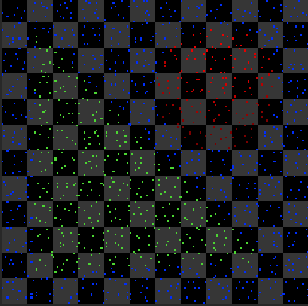

# Assignment 7: Supersampling and Antialiasing


## 1 代码实现


### 1.1 Sampler类


```c++
class Sampler
{
public:
	Sampler(int n) :n(n) {}
	
	virtual Vec2f getSamplePosition(int i) = 0;


protected:
	int n;
};
```


##### RandomSampler

```c++
class RandomSampler :public Sampler
{
public:
	RandomSampler(int i):Sampler(n)
	{
		srand((unsigned int)(time(NULL)));
	}
	virtual Vec2f getSamplePosition(int i)
	{
		return Vec2f((float)rand() / (float)RAND_MAX, (float)rand() / (float)RAND_MAX);
	}


};
```


##### UniformSampler

```c++
class UniformSampler : public Sampler
{
public:

	UniformSampler(int n) :Sampler(n) 
	{
		axisN = sqrtf(n);
		step = 1.0 / (float)axisN;
		offset = step / 2.0;
	}
	virtual Vec2f getSamplePosition(int i)
	{
		assert(i < n);
		int x = i % axisN;
		int y = i / axisN;
		return Vec2f(offset + x * step, offset + y * step);
	}


private:
	int axisN;
	float step;
	float offset;
};

```


##### JitteredSampler

```c++
class JitteredSampler: public Sampler
{

public:

	JitteredSampler(int n) :Sampler(n) 
	{
		srand((unsigned int)(time(NULL)));
		axisN = sqrtf(n);
		step = 1.0 / (float)axisN;
		offset = step / 2;
	}
	virtual Vec2f getSamplePosition(int i)
	{
		assert(i < n);
		int x = i % axisN;
		int y = i / axisN;
		Vec2f center(x * step, y * step);
		Vec2f random((float)rand() / (float)RAND_MAX * step, (float)rand() / (float)RAND_MAX * step);
		return Vec2f(center.x()+random.x(),center.y()+random.y());
	}

private:
	int axisN;
	float step;
	float offset;
};
```


### 1.2 Filter类


注意边界时采样不能越界

```c++
class Filter
{

public:
	Filter(){}

	Vec3f getColor(int x, int y, Film* film)
	{
		int supportRadius=getSupportRadius();
		int numSamples = film->getNumSamples();
		int width = film->getWidth();
		int height = film->getHeight();
		float totalWeight = 0;
		Vec3f color;
		for (int i = x - supportRadius; i<= x + supportRadius; i++)
		{
			if (i < 0)
			{
				continue;
			}
			else if (i >= width)
			{
				break;
			}
			for (int j = y - supportRadius; j <= y + supportRadius; j++)
			{
				if (j < 0)
				{
					continue;
				}
				else if(j>=height)
				{
					break;
				}
				for (int k = 0; k < numSamples; k++)
				{
					Sample sample=film->getSample(i, j, k);
					Vec2f samplePosition(i+ sample.getPosition().x(),j+sample.getPosition().y());
					float xoffset = samplePosition.x() - x - 0.5;
					float yoffset = samplePosition.y() - y - 0.5;
					float weight = getWeight(xoffset, yoffset);
					color+=sample.getColor() * weight;
					totalWeight += weight;
				}
			}
		}
		
		return color*(1.0/totalWeight);
	}


	virtual float getWeight(float x, float y) = 0;
	virtual int getSupportRadius() = 0;

private:
};

```


##### BoxFilter

```c++
class BoxFilter : public Filter
{
public:
	BoxFilter(float radius) :radius(radius)
	{

	}

	virtual float getWeight(float x, float y)
	{
		if (fabs(x) > radius || fabs(y) > radius)
		{
			return 0;
		}
		else
		{
			return 1;
		}
	}
	virtual int getSupportRadius()
	{
		return ceil(radius-0.5);
	}

private:
	float radius;
};

class TentFilter : public Filter
{

public:
	TentFilter(float radius) :radius(radius)
	{

	}
	virtual float getWeight(float x, float y)
	{
		Vec2f vec(fabs(x),fabs(y));
		return fmax(0 , 1.0 -vec.Length() / radius);
	}
	virtual int getSupportRadius()
	{
		return ceil(radius - 0.5);
	}


private:
	float radius;

};
```


##### GaussianFilter

```c++
class GaussianFilter :public Filter
{

public:
	GaussianFilter(float sigma) :sigma(sigma)
	{
	}
	virtual float getWeight(float x, float y)
	{
		Vec2f vec(fabs(x), fabs(y));
		float d = vec.Length();

		return exp(-powf(d, 2) / (2 * powf(sigma, 2)));
	}
	virtual int getSupportRadius()
	{
		return ceil(2*sigma - 0.5);
	}

private:
	float sigma;
};
```


### 1.3 修改RayTracer

修改RayCast流程以使用Sampler和Filter

```c++
	//Assignment7 
	void RayCastSample(char* outputFile)
	{
        Image outputImage(width, height);
        int xoffset = 0;
        int yoffset = 0;

        //deal with width!=height
        yoffset =max( 0, (squareLength - height) / 2);
        xoffset =max(0, (squareLength - width) / 2);

        for (int i = 0; i < width * height; i++)
        {
            int x = i % width;
            int y = i / width;
            int xrayIndex = x + xoffset;
            int yrayIndex = y + yoffset;

            //sampling
            for (int s = 0; s < numSamples; s++)
            {
                Vec2f sampleOffset=sampler->getSamplePosition(s);
                
                Hit hit;
                Ray ray = generateRayAtIndexWithOffset(xrayIndex, yrayIndex, sampleOffset);
                
                Vec3f color = (this->*tracerayFunction)(ray, scene->getCamera()->getTMin(), 0, 1, VACUUM_REFRACTION_INDEX, hit);
                //cout << "color: " << color<<endl;
                film->setSample(x, y, s, sampleOffset, color);
            }
        }

        for (int i = 0; i < width * height; i++)
        {
            int x = i % width;
            int y = i / width;
            outputImage.SetPixel(x,y,filter->getColor(x, y, film));
        }
        if(outputFile!=NULL)
            outputImage.SaveTGA(outputFile);
	}
```


## 2 实验结果


```shell
raytracer -input scene7_01_sphere_triangle.txt -size 180 180 -output output7_01.tga 
```


```shell
raytracer -input scene7_01_sphere_triangle.txt -size 9 9 -render_samples samples7_01a.tga 20 -random_samples 4
raytracer -input scene7_01_sphere_triangle.txt -size 9 9 -render_samples samples7_01b.tga 20 -uniform_samples 4
raytracer -input scene7_01_sphere_triangle.txt -size 9 9 -render_samples samples7_01c.tga 20 -jittered_samples 4
raytracer -input scene7_01_sphere_triangle.txt -size 9 9 -render_samples samples7_01d.tga 20 -random_samples 9
raytracer -input scene7_01_sphere_triangle.txt -size 9 9 -render_samples samples7_01e.tga 20 -uniform_samples 9
raytracer -input scene7_01_sphere_triangle.txt -size 9 9 -render_samples samples7_01f.tga 20 -jittered_samples 9
raytracer -input scene7_01_sphere_triangle.txt -size 9 9 -render_samples samples7_01g.tga 20 -random_samples 36
raytracer -input scene7_01_sphere_triangle.txt -size 9 9 -render_samples samples7_01h.tga 20 -uniform_samples 36
raytracer -input scene7_01_sphere_triangle.txt -size 9 9 -render_samples samples7_01i.tga 20 -jittered_samples 36
```


```shell
raytracer -input scene7_01_sphere_triangle.txt -size 9 9 -render_filter filter7_01a.tga 20 -box_filter 0.5
raytracer -input scene7_01_sphere_triangle.txt -size 9 9 -render_filter filter7_01b.tga 20 -tent_filter 0.5
raytracer -input scene7_01_sphere_triangle.txt -size 9 9 -render_filter filter7_01c.tga 20 -gaussian_filter 0.5
raytracer -input scene7_01_sphere_triangle.txt -size 9 9 -render_filter filter7_01d.tga 20 -box_filter 1.7
raytracer -input scene7_01_sphere_triangle.txt -size 9 9 -render_filter filter7_01e.tga 20 -tent_filter 1.7
raytracer -input scene7_01_sphere_triangle.txt -size 9 9 -render_filter filter7_01f.tga 20 -gaussian_filter 1.7
raytracer -input scene7_01_sphere_triangle.txt -size 9 9 -render_filter filter7_01g.tga 20 -box_filter 2.3
raytracer -input scene7_01_sphere_triangle.txt -size 9 9 -render_filter filter7_01h.tga 20 -tent_filter 2.3
raytracer -input scene7_01_sphere_triangle.txt -size 9 9 -render_filter filter7_01i.tga 20 -gaussian_filter 2.3
```


```shell
raytracer -input scene7_01_sphere_triangle.txt -size 12 12 -output output7_01_low_res.tga
raytracer -input scene7_01_sphere_triangle.txt -size 12 12 -render_samples samples7_01a_low_res.tga 15 -random_samples 9 
raytracer -input scene7_01_sphere_triangle.txt -size 12 12 -render_samples samples7_01b_low_res.tga 15 -uniform_samples 9
raytracer -input scene7_01_sphere_triangle.txt -size 12 12 -render_samples samples7_01c_low_res.tga 15 -jittered_samples 9
raytracer -input scene7_01_sphere_triangle.txt -size 12 12 -render_filter filter7_01a_low_res.tga 15 -box_filter 0.5
raytracer -input scene7_01_sphere_triangle.txt -size 12 12 -render_filter filter7_01b_low_res.tga 15 -tent_filter 1.5
raytracer -input scene7_01_sphere_triangle.txt -size 12 12 -render_filter filter7_01c_low_res.tga 15 -gaussian_filter 1.0
raytracer -input scene7_01_sphere_triangle.txt -size 12 12 -output output7_01a_low_res.tga -random_samples 9 -box_filter 0.5
raytracer -input scene7_01_sphere_triangle.txt -size 12 12 -output output7_01b_low_res.tga -random_samples 9 -tent_filter 1.5
raytracer -input scene7_01_sphere_triangle.txt -size 12 12 -output output7_01c_low_res.tga -random_samples 9 -gaussian_filter 1.0
raytracer -input scene7_01_sphere_triangle.txt -size 12 12 -output output7_01d_low_res.tga -uniform_samples 9 -box_filter 0.5
raytracer -input scene7_01_sphere_triangle.txt -size 12 12 -output output7_01e_low_res.tga -uniform_samples 9 -tent_filter 1.5
raytracer -input scene7_01_sphere_triangle.txt -size 12 12 -output output7_01f_low_res.tga -uniform_samples 9 -gaussian_filter 1.0
raytracer -input scene7_01_sphere_triangle.txt -size 12 12 -output output7_01g_low_res.tga -jittered_samples 9 -box_filter 0.5
raytracer -input scene7_01_sphere_triangle.txt -size 12 12 -output output7_01h_low_res.tga -jittered_samples 9 -tent_filter 1.5
raytracer -input scene7_01_sphere_triangle.txt -size 12 12 -output output7_01i_low_res.tga -jittered_samples 9 -gaussian_filter 1.0
```





```shell
raytracer -input scene7_02_checkerboard.txt -size 180 180 -output output7_02.tga 
raytracer -input scene7_02_checkerboard.txt -size 9 9 -render_samples samples7_02a.tga 20 -random_samples 16
raytracer -input scene7_02_checkerboard.txt -size 9 9 -render_samples samples7_02b.tga 20 -uniform_samples 16
raytracer -input scene7_02_checkerboard.txt -size 9 9 -render_samples samples7_02c.tga 20 -jittered_samples 16
raytracer -input scene7_02_checkerboard.txt -size 9 9 -render_filter filter7_02a.tga 20 -box_filter 0.5
raytracer -input scene7_02_checkerboard.txt -size 9 9 -render_filter filter7_02b.tga 20 -tent_filter 1.5
raytracer -input scene7_02_checkerboard.txt -size 9 9 -render_filter filter7_02c.tga 20 -gaussian_filter 0.6
raytracer -input scene7_02_checkerboard.txt -size 180 180 -output output7_02a.tga -random_samples 16 -box_filter 0.5
raytracer -input scene7_02_checkerboard.txt -size 180 180 -output output7_02b.tga -random_samples 16 -tent_filter 1.5
raytracer -input scene7_02_checkerboard.txt -size 180 180 -output output7_02c.tga -random_samples 16 -gaussian_filter 0.6
raytracer -input scene7_02_checkerboard.txt -size 180 180 -output output7_02d.tga -uniform_samples 16 -box_filter 0.5
raytracer -input scene7_02_checkerboard.txt -size 180 180 -output output7_02e.tga -uniform_samples 16 -tent_filter 1.5
raytracer -input scene7_02_checkerboard.txt -size 180 180 -output output7_02f.tga -uniform_samples 16 -gaussian_filter 0.6
raytracer -input scene7_02_checkerboard.txt -size 180 180 -output output7_02g.tga -jittered_samples 16 -box_filter 0.5
raytracer -input scene7_02_checkerboard.txt -size 180 180 -output output7_02h.tga -jittered_samples 16 -tent_filter 1.5
raytracer -input scene7_02_checkerboard.txt -size 180 180 -output output7_02i.tga -jittered_samples 16 -gaussian_filter 0.6
```


```shell
raytracer -input scene7_03_marble_vase.txt  -size 200 200 -output output7_03a.tga -grid 15 30 15 -shadows
raytracer -input scene7_03_marble_vase.txt  -size 200 200 -output output7_03b.tga -grid 15 30 15 -shadows -jittered_samples 4 -gaussian_filter 0.4
raytracer -input scene7_03_marble_vase.txt  -size 200 200 -output output7_03c.tga -grid 15 30 15 -shadows -jittered_samples 9 -gaussian_filter 0.4
raytracer -input scene7_03_marble_vase.txt  -size 200 200 -output output7_03d.tga -grid 15 30 15 -shadows -jittered_samples 36 -gaussian_filter 0.4
```


```shell
raytracer -input scene7_04_6.837_logo.txt   -size 400 200 -output output7_04a.tga -shadows -shade_back -bounces 5 -weight 0.01 -grid 80 30 3
raytracer -input scene7_04_6.837_logo.txt   -size 400 200 -output output7_04b.tga -shadows -shade_back -bounces 5 -weight 0.01 -grid 80 30 3 -jittered_samples 9 -gaussian_filter 0.4
```


```shell
raytracer -input scene7_05_glass_sphere.txt -size 300 300 -output output7_05a.tga -shadows -shade_back -bounces 5 -weight 0.01 -grid 20 20 20
raytracer -input scene7_05_glass_sphere.txt -size 300 300 -output output7_05b.tga -shadows -shade_back -bounces 5 -weight 0.01 -grid 20 20 20 -jittered_samples 4 -gaussian_filter 0.4
raytracer -input scene7_05_glass_sphere.txt -size 300 300 -output output7_05c.tga -shadows -shade_back -bounces 5 -weight 0.01 -grid 20 20 20 -jittered_samples 16 -gaussian_filter 0.4
```


```shell
raytracer -input scene7_06_faceted_gem.txt -size 200 200 -output output7_06a.tga -shadows -shade_back -bounces 5 -weight 0.01 -grid 20 20 20 
raytracer -input scene7_06_faceted_gem.txt -size 200 200 -output output7_06b.tga -shadows -shade_back -bounces 5 -weight 0.01 -grid 20 20 20 -jittered_samples 9 -gaussian_filter 0.4
```


