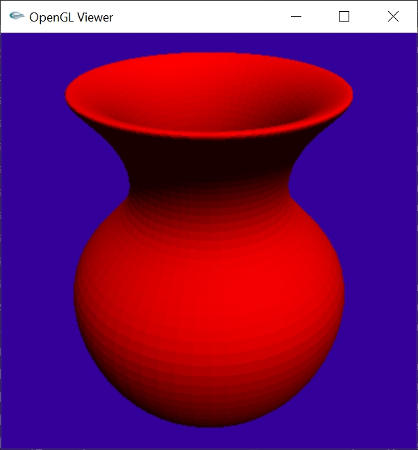

# Assignment 8: Curves & Surfaces

##### 陈九润 3180105488


## 1 代码


### 1.1 Spline

```c++
class Spline
{
public:

	Spline()
	{
		B_Bezier = getB_Bezier();
		B_BSpline = getB_BSpline();
		B_BezierToB_BSpline = getB_BesierToB_BSpline();
		B_BSplineToB_Bezier = getB_BSplinerToB_Bezier();
	}


	// FOR VISUALIZATION
	virtual void Paint(ArgParser* args)
	{

	}

	// FOR CONVERTING BETWEEN SPLINE TYPES
	virtual void OutputBezier(FILE* file)
	{

	}
	virtual void OutputBSpline(FILE* file)
	{

	}

	// FOR CONTROL POINT PICKING
	virtual int getNumVertices()
	{
		return controlPoints.size();
	}
	virtual Vec3f getVertex(int i)
	{
		return controlPoints[i];
	}

	// FOR EDITING OPERATIONS
	virtual void moveControlPoint(int selectedPoint, float x, float y)
	{
		controlPoints[selectedPoint].Set(0, x);
		controlPoints[selectedPoint].Set(1, y);
	}


	virtual void set(int index, Vec3f point)
	{
		controlPoints.insert(controlPoints.begin() + index, point);
		updateNumSplines();

	}

	virtual void addControlPoint(int selectedPoint, float x, float y)
	{
		controlPoints.insert(controlPoints.begin() + selectedPoint, Vec3f(x, y, 0));
		updateNumSplines();

	}

	virtual void deleteControlPoint(int selectedPoint)
	{
		controlPoints.erase(controlPoints.begin() + selectedPoint);
		updateNumSplines();
	}

	// FOR GENERATING TRIANGLES
	virtual TriangleMesh* OutputTriangles(ArgParser* args)
	{
		return NULL;
	}


	virtual Vec3f Q(float t)
	{
		return Vec3f(1, 1, 1);
	}


protected:
	Matrix B_Bezier;
	Matrix B_BSpline;
	Matrix B;
	Matrix B_BezierToB_BSpline;
	Matrix B_BSplineToB_Bezier;
	vector<Vec3f> controlPoints;
	int numSplines;

	Vec4f getT(float t)
	{
		//assert(t >= 0 && t <= 1);
		float power = 1;
		Vec4f T;
		for (int i = 0; i < 4; i++)
		{
			T.Set(i, power);
			power *= t;
		}
		return T;
	}


private:
	virtual void updateNumSplines()
	{

	}

	
};
```


### 1.2 Q函数的实现


曲线的Q函数为给定参数计算贝塞尔曲线插值点的函数

实现了插值点的复用以支持不为3整数倍和个数小于3的控制点

t的有效范围为 0-numSplines

##### 贝塞尔曲线的Q函数

```c++
	virtual Vec3f Q(float t)
	{
		assert(numSplines > 0);
		int splineIndex;

		splineIndex = floor(t);

		if (splineIndex >= numSplines)
		{
			splineIndex = numSplines - 1;
		}
		else if (splineIndex < 0)
		{
			splineIndex = 0;
		}

		t = t - splineIndex;
		Vec3f localControlPoints[4];
		assert(controlPoints.size() > 3 * splineIndex);
		for (int i = 0; i < 4; i++)
		{
			if (controlPoints.size() > 3 * splineIndex + i)
			{
				localControlPoints[i] = controlPoints[3 * splineIndex + i];
			}
			else
			{
				localControlPoints[i] = localControlPoints[i-1];

			}
		}

		Vec3f Q;
		Vec4f T = getT(t);
		B.Transform(T);

		Matrix G;
		G.Clear();
		for (int i = 0; i < 3; i++)
		{
			for (int j = 0; j < 4; j++)
			{
				G.Set(j, i, localControlPoints[j][i]);
			}
		}

		G.Transform(T);

		Q.Set(T[0], T[1], T[2]);

		return Q;
	}
```


##### B样条曲线的Q函数

```c++

	virtual Vec3f Q(float t)
	{
		assert(numSplines > 0);

		int splineIndex;

		splineIndex = floor(t);
		if (splineIndex >= numSplines)
		{
			splineIndex = numSplines - 1;
		}
		else if (splineIndex < 0)
		{
			splineIndex = 0;
		}

		t = t - splineIndex;

		Vec3f localControlPoints[4];
		assert(controlPoints.size() > 0);
		for (int i = 0; i < 4; i++)
		{

			if(controlPoints.size() > splineIndex + i)
			{
				localControlPoints[i] = controlPoints[splineIndex + i];
			}
			else
			{
				localControlPoints[i] = localControlPoints[i - 1];
			}
		}

		Vec3f Q;
		Vec4f T = getT(t);
		B.Transform(T);


		Matrix G;
		G.Clear();
		for (int i = 0; i < 3; i++)
		{
			for (int j = 0; j < 4; j++)
			{
				G.Set(j, i, localControlPoints[j][i]);
			}
		}

		G.Transform(T);

		Q.Set(T[0], T[1], T[2]);

		return Q;
	}
```


### 1.3 Curve::Paint

Paint函数通过生成一系列离散的t值调用Q函数获取插值点并在OpenGL中绘制

```c++
	virtual void Paint(ArgParser* args)
	{

		if (numSplines <= 0)
		{
			return;
		}

		glLineWidth(3);
		glColor3f(0, 0, 1);
		glBegin(GL_LINE_STRIP);
		for (auto i = controlPoints.begin(); i != controlPoints.end(); i++)
		{
			glVertex3f(i->x(), i->y(), i->z());
		}
		glEnd();

		glLineWidth(3);
		glColor3f(0, 1, 0);
		glBegin(GL_LINE_STRIP);
		float step= 1.0 / (float)args->curve_tessellation;
		float t = 0;
		
		for (int i = 0; i < numSplines; i++)
		{
			t = i;
			for (int j = 0; j <= args->curve_tessellation; j++)
			{
				Vec3f vertex = Q(t);
				glVertex3f(vertex[0], vertex[1], vertex[2]);
				t += step;
			}
		}
		glEnd();

		//control points
		glPointSize(5);
		glColor3f(1, 0, 0);
		glBegin(GL_POINTS);
		for (auto i = controlPoints.begin(); i != controlPoints.end(); i++)
		{
			glVertex3f(i->x(), i->y(), i->z());
		}
		glEnd();
	}

```


### 1.4 贝塞尔曲线和B样条曲线转换

使用基矩阵的逆实现转换

##### 贝塞尔转B样条

```c++
	//G_BSpline = G_Bezier * B_BSplineToB_Bezier
	virtual void OutputBSpline(FILE* file)
	{
		Matrix G_Bezier;
		G_Bezier.Clear();
		for (int i = 0; i < 3; i++)
		{
			for (int j = 0; j < 4; j++)
			{
				G_Bezier.Set(j, i, controlPoints[j][i]);
			}
		}

		Matrix G_BSpline = G_Bezier * B_BSplineToB_Bezier;
		fprintf(file, "bspline ");
		fprintf(file, "num_vertices %d", 4);
		for (int i = 0; i < 4; i++)
		{
			fprintf(file, " %f %f %f", G_BSpline.Get(i,0), G_BSpline.Get(i, 1), G_BSpline.Get(i, 2));
		}
		fprintf(file, "\n");


	}
```

##### B样条转贝塞尔

```c++
	//G_Bezier = G_BSpline * B_BezierToB_BSpline
	virtual void OutputBezier(FILE* file)
	{
		Matrix G_BSpline;
		G_BSpline.Clear();
		for (int i = 0; i < 3; i++)
		{
			for (int j = 0; j < 4; j++)
			{
				G_BSpline.Set(j, i, controlPoints[j][i]);
			}
		}
		Matrix G_Bezier = G_BSpline * B_BezierToB_BSpline;

		fprintf(file, "bezier ");
		fprintf(file, "num_vertices %d", 4);
		for (int i = 0; i < 4; i++)
		{
			fprintf(file, " %f %f %f", G_Bezier.Get(i, 0), G_Bezier.Get(i, 1), G_Bezier.Get(i, 2));
		}
		fprintf(file, "\n");

	}
```


### 1.5 SurfaceOfRevolution

```c++
class SurfaceOfRevolution : public Surface
{
public:
	SurfaceOfRevolution(Curve *c):curve(c)
	{
	}

	virtual void Paint(ArgParser* args)
	{
		curve->Paint(args);
	}

	// FOR GENERATING TRIANGLES
	virtual TriangleMesh* OutputTriangles(ArgParser* args)
	{
		return curve->OutputTriangles(args);
	}


	virtual void addControlPoint(int selectedPoint, float x, float y)
	{
		curve->addControlPoint(selectedPoint, x, y);
	}

	virtual void deleteControlPoint(int selectedPoint)
	{
		curve->deleteControlPoint(selectedPoint);
	}


	virtual void moveControlPoint(int selectedPoint, float x, float y)
	{
		curve->moveControlPoint(selectedPoint, x, y);
	}


	// FOR CONVERTING BETWEEN SPLINE TYPES
	virtual void OutputBezier(FILE* file)
	{
		curve->OutputBezier(file);
	}
	virtual void OutputBSpline(FILE* file)
	{
		curve->OutputBSpline(file);
	}

	// FOR CONTROL POINT PICKING
	virtual int getNumVertices()
	{
		return curve->getNumVertices();
	}
	virtual Vec3f getVertex(int i)
	{
		return curve->getVertex(i);
	}

	virtual void set(int index, Vec3f point)
	{
		curve->set(index, point);
	}


private:
	Curve* curve;
};
```


### 1.6 OutputTriangle

```c++
	// FOR GENERATING TRIANGLES
	virtual TriangleMesh* OutputTriangles(ArgParser* args)
	{
		TriangleNet* triangleNet=new TriangleNet(args->revolution_tessellation,args->curve_tessellation*numSplines);


		float uStep = 2.0f * PI / (float) args->revolution_tessellation;
		float vStep = 1.0f / (float)args->curve_tessellation;
		float phi = 0;

		for (int k = 0; k <= args->revolution_tessellation; k++)
		{
			float cosPhi = cosf(phi);
			float sinPhi = sinf(phi);
			for (int i = 0; i < numSplines; i++)
			{
				float t = i;
				for (int j = 0; j <= args->curve_tessellation; j++)
				{
					Vec3f vertex = Q(t);
					float length = sqrtf(powf(vertex.x(), 2) + powf(vertex.z(), 2));
					triangleNet->SetVertex( k , i * args->curve_tessellation + j, Vec3f(length*cosPhi,vertex.y(), length *sinPhi));
					t += vStep;
				}
			}

			phi += uStep;
		}
		return triangleNet;

	}
```

##### 

### 1.7 BezierPatch

由8个贝塞尔曲线组成

```c++
class BezierPatch : public Surface
{
public:
	BezierPatch()
	{
		controlPoints.reserve(16);

		for (int i = 0; i < 4; i++)
		{
			uBezierCurves[i] = new BezierCurve(4);
			vBezierCurves[i] = new BezierCurve(4);
		}

	}

	virtual void set(int index, Vec3f point)
	{
		controlPoints.insert(controlPoints.begin() + index, point);
		if (controlPoints.size() == 16)
		{
			for (int i = 0; i < 4; i++)
			{
				for (int j = 0; j < 4; j++)
				{
					uBezierCurves[i]->set(j, controlPoints[i * 4 + j]);
					vBezierCurves[i]->set(j, controlPoints[j * 4 + i]);
				}
			}
		}
	}

	virtual void Paint(ArgParser* args)
	{

		for (int i = 0; i < 4; i++)
		{
			uBezierCurves[i]->Paint(args);
			vBezierCurves[i]->Paint(args);
		}
	}

	virtual TriangleMesh* OutputTriangles(ArgParser* args)
	{
		float step = 1.0 / (float)args->patch_tessellation;
		TriangleNet* triangleNet = new TriangleNet(args->patch_tessellation, args->patch_tessellation);
		
		float u = 0;
		for (int i = 0; i <= args->patch_tessellation; i++)
		{
			BezierCurve newCurve(4);
			for (int k = 0; k < 4; k++)
			{
				newCurve.set(k, uBezierCurves[k]->Q(u));
			}

			float v = 0;
			for (int j = 0; j <= args->patch_tessellation; j++)
			{
				Vec3f vertex=newCurve.Q(v);
				triangleNet->SetVertex(i, j, vertex);
				v += step;
			}
			u += step;
		}

		return triangleNet;
	}


private:
	BezierCurve* uBezierCurves[4];
	BezierCurve* vBezierCurves[4];


};
```


## 2 实验结果


```shell
curve_editor -input spline8_01_bezier.txt -gui -curve_tessellation 30
curve_editor -input spline8_02_bspline.txt -gui -curve_tessellation 30
```


```shell
curve_editor -input spline8_01_bezier.txt -output_bezier output8_01_bezier.txt
curve_editor -input spline8_01_bezier.txt -output_bspline output8_01_bspline.txt
curve_editor -input spline8_02_bspline.txt -output_bezier output8_02_bezier.txt
curve_editor -input spline8_02_bspline.txt -output_bspline output8_02_bspline.txt
curve_editor -input output8_01_bezier.txt -gui -curve_tessellation 30
curve_editor -input output8_01_bspline.txt -gui -curve_tessellation 30
curve_editor -input output8_02_bezier.txt -gui -curve_tessellation 30
curve_editor -input output8_02_bspline.txt -gui -curve_tessellation 30
```


```shell
curve_editor -input spline8_03_bezier.txt -gui -curve_tessellation 30
curve_editor -input spline8_04_bspline.txt -gui -curve_tessellation 30
curve_editor -input spline8_05_bspline_dups.txt -gui -curve_tessellation 30
```


```shell
curve_editor -input spline8_06_torus.txt -curve_tessellation 4 -gui
curve_editor -input spline8_06_torus.txt -curve_tessellation 4 -revolution_tessellation 10 -output torus_low.obj
curve_editor -input spline8_06_torus.txt -curve_tessellation 30 -revolution_tessellation 60 -output torus_high.obj
raytracer -input scene8_06_torus_low.txt -gui -size 300 300
raytracer -input scene8_06_torus_high.txt -gui -size 300 300
```


```shell
curve_editor -input spline8_07_vase.txt -curve_tessellation 4 -output_bspline output8_07_edit.txt -gui
curve_editor -input output8_07_edit.txt -curve_tessellation 4 -revolution_tessellation 10 -output vase_low.obj
curve_editor -input output8_07_edit.txt -curve_tessellation 10 -revolution_tessellation 60 -output vase_high.obj
raytracer -input scene8_07_vase_low.txt -gui -size 300 300
raytracer -input scene8_07_vase_high.txt -gui -size 300 300
```





```shell
curve_editor -input spline8_08_bezier_patch.txt -gui
curve_editor -input spline8_08_bezier_patch.txt -patch_tessellation 4 -output patch_low.obj
curve_editor -input spline8_08_bezier_patch.txt -patch_tessellation 10 -output patch_med.obj
curve_editor -input spline8_08_bezier_patch.txt -patch_tessellation 40 -output patch_high.obj
raytracer -input scene8_08_bezier_patch_low.txt -gui -size 300 300
raytracer -input scene8_08_bezier_patch_med.txt -gui -size 300 300
raytracer -input scene8_08_bezier_patch_high.txt -gui -size 300 300
```


```shell
curve_editor -input spline8_09_teapot.txt -curve_tessellation 4 -gui
curve_editor -input spline8_09_teapot.txt -patch_tessellation 4 -curve_tessellation 4 -revolution_tessellation 10 -output teapot_low.obj
curve_editor -input spline8_09_teapot.txt -patch_tessellation 30 -curve_tessellation 30 -revolution_tessellation 100 -output teapot_high.obj
raytracer -input scene8_09_teapot_low.txt -gui -size 300 300
raytracer -input scene8_09_teapot_high.txt -gui -size 300 300
```


```shell
curve_editor -input output8_07_edit.txt -curve_tessellation 20 -revolution_tessellation 100 -output vase_very_high.obj
raytracer -input scene8_10_transparent_vase.txt -output output8_10.tga -grid 30 30 30 -size 300 300 -bounces 4 -shade_back -jittered_samples 9 -tent_filter 1.0 -shadows
raytracer -input scene8_11_reflective_teapot.txt -output output8_11.tga -grid 50 30 30 -size 300 300 -bounces 4 -shade_back -jittered_samples 9 -tent_filter 1.0 -shadows
```


