# Assignment 9: Particle Systems


## 1 代码实现


### 1.1 ForceField及子类

```c++
class ForceField
{
public:
	virtual Vec3f getAcceleration(const Vec3f& position, float mass, float t) const = 0;

};


class GravityForceField : public ForceField
{
public:
	GravityForceField(Vec3f gravity):gravity(gravity)
	{
	}
	virtual Vec3f getAcceleration(const Vec3f& position, float mass, float t) const
	{
		return gravity;
	}
private:
	Vec3f gravity;
};


class ConstantForceField : public ForceField
{
public:

	ConstantForceField(Vec3f force):force(force)
	{
	}

	virtual Vec3f getAcceleration(const Vec3f& position, float mass, float t) const
	{
		return  (1.0f / mass)* force;
	}

private:
	Vec3f force;
};


class RadialForceField : public ForceField
{
public:


	RadialForceField(float magnitude):magnitude(magnitude)
	{
	}

	virtual Vec3f getAcceleration(const Vec3f& position, float mass, float t) const
	{
		Vec3f direction = -1*position;
		direction.Normalize();
		float distance = position.Length();
		return magnitude * distance * (1.0f / mass)*direction;
	}


private:
	float magnitude;

};


class VerticalForceField : public ForceField
{
public:

	VerticalForceField(float magnitude) :magnitude(magnitude)
	{

	}

	virtual Vec3f getAcceleration(const Vec3f& position, float mass, float t) const
	{
		Vec3f direction(0, -position.y(), 0);
		direction.Normalize();
		float distance = fabs(position.y());
		return magnitude * distance * (1.0f / mass) * direction;
	}

private:
	float magnitude;

};

```


### 1.2 Iterator及子类

```c++
class Integrator
{
public:
	virtual void Update(Particle* particle, ForceField* forcefield, float t, float dt) = 0;
	virtual Vec3f getColor() = 0;

};


//pn+1 = pn + vn * dt
//vn + 1 = vn + a(pn, t) * dt
class EulerIntegrator : public Integrator
{
public:
	virtual void Update(Particle* particle, ForceField* forcefield, float t, float dt)
	{
		particle->increaseAge(dt);
		Vec3f velocityN = particle->getVelocity();
		Vec3f positionN = particle->getPosition();
		float mass = particle->getMass();

		Vec3f newPosition = positionN + velocityN * dt;
		Vec3f newVelocity = velocityN + forcefield->getAcceleration(positionN, mass, t)*dt;

		particle->setPosition(newPosition);
		particle->setVelocity(newVelocity);
	}

	virtual Vec3f getColor() 
	{
		return Vec3f(1, 0, 0);
	}

};


//pm = pn + vn * dt / 2
//vm = vn + a(pn, t) * dt / 2
//
//pn + 1 = pn + vm * dt
//vn + 1 = vn + a(pm, t + dt / 2) * dt
class MidpointIntegrator : public Integrator
{
public:
	virtual void Update(Particle* particle, ForceField* forcefield, float t, float dt)
	{
		particle->increaseAge(dt);

		Vec3f velocityN = particle->getVelocity();
		Vec3f positionN = particle->getPosition();
		float mass = particle->getMass();

		Vec3f positionM = positionN + velocityN * (dt / 2.0f);
		Vec3f velocityM = velocityN + forcefield->getAcceleration(positionN, mass, t) * (dt / 2.0f);

		Vec3f newPosition = positionN + velocityM * dt;
		Vec3f newVelocity = velocityN + forcefield->getAcceleration(positionM, mass, t + dt/2.0f ) * dt;

		particle->setPosition(newPosition);
		particle->setVelocity(newVelocity);
	}


	virtual Vec3f getColor()
	{
		return Vec3f(0, 1, 0);
	}

};

```


### 1.3 Generator及子类

```c++
class Generator
{
public:


	~Generator()
	{
		delete(random);
	}

	// initialization
	void SetColors(Vec3f color, Vec3f dead_color, float color_randomness)
	{
		this->color = color;
		this->deadColor = dead_color;
		this->colorRandomness = color_randomness;
	}
	void SetLifespan(float lifespan, float lifespan_randomness, int desired_num_particles)
	{
		this->lifespan = lifespan;
		this->lifespanRandomness = lifespan_randomness;
		this->desiredNumParticles = desired_num_particles;
	}
	void SetMass(float mass, float mass_randomness)
	{
		this->mass = mass;
		this->massRandomness = mass_randomness;
	}

	// on each timestep, create some particles
	// (desired_num_particles), dt * desired_num_particles / lifespan particles should be created on each timestep.
	virtual int numNewParticles(float current_time, float dt) const
	{
		return ceilf(dt * (float)desiredNumParticles / lifespan);
	}
	virtual Particle* Generate(float current_time, int i) = 0;

	// for the gui
	virtual void Paint() const
	{
	}

	void Restart()
	{
		delete random;
		random = new Random;
	}


protected:
	Vec3f color;
	Vec3f deadColor;
	float colorRandomness;
	float lifespan;
	float lifespanRandomness;
	int desiredNumParticles;
	float mass;
	float massRandomness;
	Random* random;

};


class HoseGenerator : public Generator
{
public:
	HoseGenerator(Vec3f position, float position_randomness, Vec3f velocity, float velocity_randomness):
		position(position), positionRandomness(position_randomness),velocity(velocity), velocityRandomness(velocity_randomness)
	{

	}

	virtual Particle* Generate(float current_time, int i)
	{
		Vec3f pPosition = position + positionRandomness * random->randomVector();
		Vec3f pVelocity = velocity + velocityRandomness * random->randomVector();
		Vec3f pColor = color + colorRandomness * random->randomVector();
		Vec3f pDeadColor = deadColor + colorRandomness * random->randomVector();
		float pMass = mass + massRandomness * random->next();
		float pLifespan = lifespan + lifespanRandomness * random->next();

		return new Particle(pPosition, pVelocity, pColor, pDeadColor, pMass, pLifespan);
	}
	

private:
	Vec3f position;
	float positionRandomness;
	Vec3f velocity;
	float velocityRandomness;

};


class RingGenerator : public Generator
{
public:
	RingGenerator(float position_randomness, Vec3f velocity, float velocity_randomness):
		positionRandomness(position_randomness),velocity(velocity),velocityRandomness(velocity_randomness)
	{
	}


	virtual Particle* Generate(float current_time, int i)
	{
		float radius = current_time;
		Vec3f pPosition(radius*sinf(i)+positionRandomness*random->next(),0,radius*cosf(i)+positionRandomness*random->next());
		Vec3f pVelocity = velocity + velocityRandomness * random->randomVector();
		Vec3f pColor = color + colorRandomness * random->randomVector();
		Vec3f pDeadColor = deadColor + colorRandomness * random->randomVector();
		float pMass = mass + massRandomness * random->next();
		float pLifespan = lifespan + lifespanRandomness * random->next();

		return new Particle(pPosition, pVelocity, pColor, pDeadColor, pMass, pLifespan);
	}


	virtual int numNewParticles(float current_time, float dt) const
	{
		return ceilf(current_time*(dt * (float)desiredNumParticles / lifespan));
	}


	virtual void Paint() const
	{
		glColor3f(1.0, 1.0, 1.0);
		glBegin(GL_QUADS);
		glVertex3f(10, 0, 10);
		glVertex3f(10, 0, -10);
		glVertex3f(-10, 0, -10);
		glVertex3f(-10, 0, 10);
		glEnd();
	}

private:
	float positionRandomness;
	Vec3f velocity;
	float velocityRandomness;
};
```


## 2 实验结果


```shell
particle_system -input system9_01_hose.txt -refresh 0.1  -dt 0.1 
particle_system -input system9_01_hose.txt -refresh 0.05 -dt 0.05
particle_system -input system9_01_hose.txt -refresh 0.1  -dt 0.1  -motion_blur
particle_system -input system9_01_hose.txt -refresh 0.05 -dt 0.05 -motion_blur
```

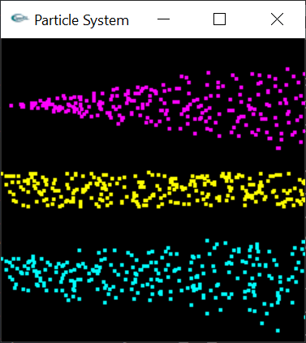

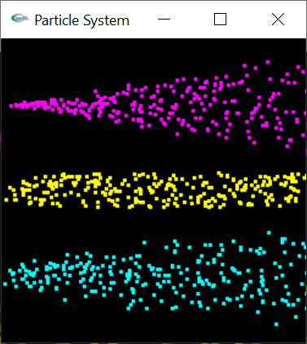

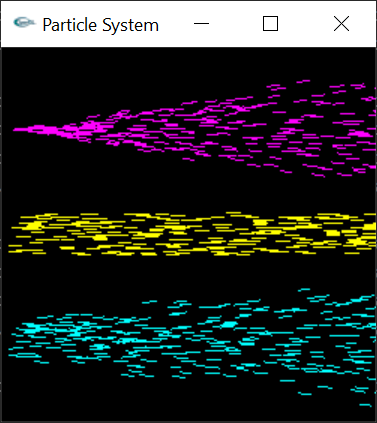

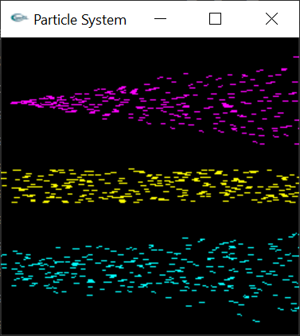


```shell
particle_system -input system9_02_hose_gravity.txt -refresh 0.05 -dt 0.05 -draw_vectors 0.1
particle_system -input system9_02_hose_gravity.txt -refresh 0.05 -dt 0.05 -motion_blur
```

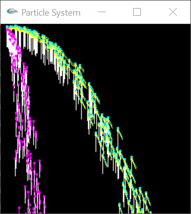

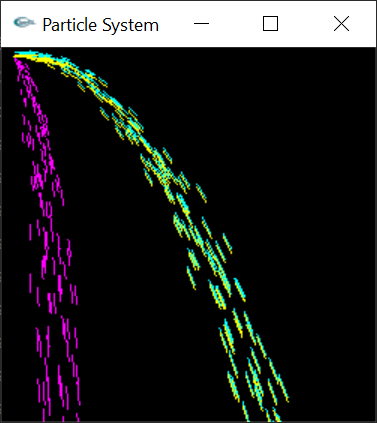


```shell
particle_system -input system9_03_hose_force.txt -refresh 0.05 -dt 0.05 -draw_vectors 0.1
particle_system -input system9_03_hose_force.txt -refresh 0.05 -dt 0.05 -motion_blur
```

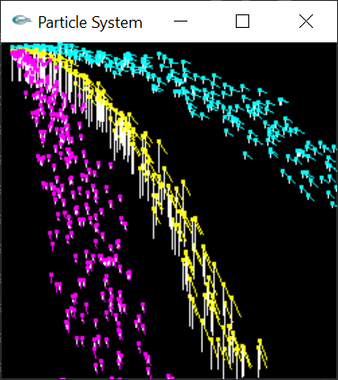

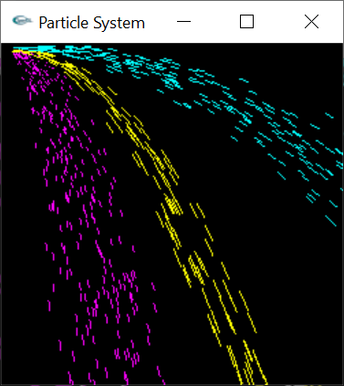


```shell
particle_system -input system9_04_circle_euler.txt -refresh 0.1  -dt 0.1  -integrator_color -draw_vectors 0.02
particle_system -input system9_04_circle_euler.txt -refresh 0.05 -dt 0.05 -integrator_color -motion_blur
particle_system -input system9_04_circle_euler.txt -refresh 0.01 -dt 0.01 -integrator_color -motion_blur
```

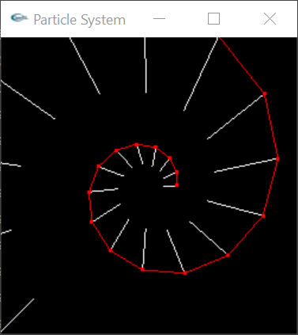

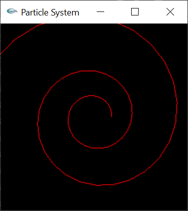

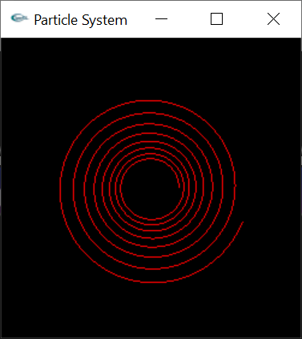


```shell
particle_system -input system9_05_circle_midpoint.txt -refresh 0.1  -dt 0.1  -integrator_color -draw_vectors 0.02
particle_system -input system9_05_circle_midpoint.txt -refresh 0.05 -dt 0.05 -integrator_color -motion_blur
particle_system -input system9_05_circle_midpoint.txt -refresh 0.01 -dt 0.01 -integrator_color -motion_blur
```

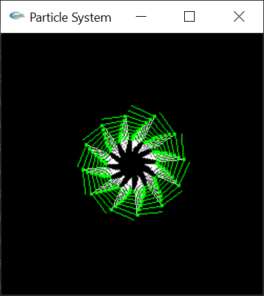

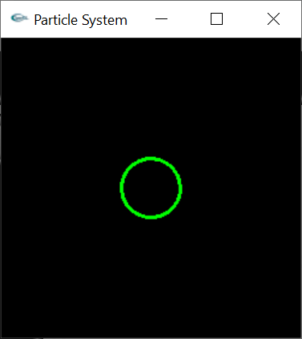

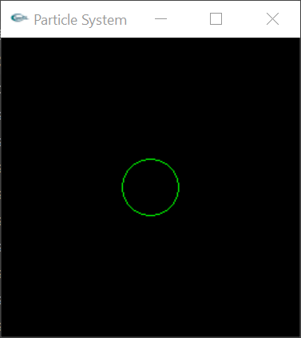


```
particle_system -input system9_07_wave.txt -refresh 0.01 -dt 0.2  -integrator_color -motion_blur
particle_system -input system9_07_wave.txt -refresh 0.01 -dt 0.05 -integrator_color -motion_blur
particle_system -input system9_07_wave.txt -refresh 0.01 -dt 0.01 -integrator_color -motion_blur
```

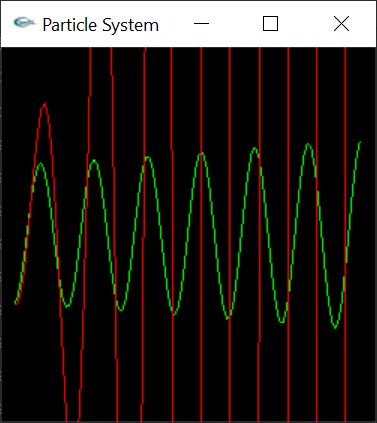

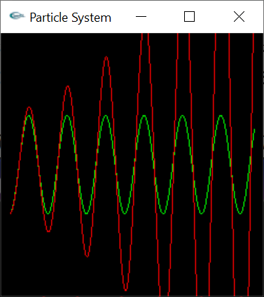

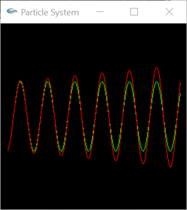


```shell
particle_system -input system9_08_fire.txt -refresh 0.05 -dt 0.05  -motion_blur
```

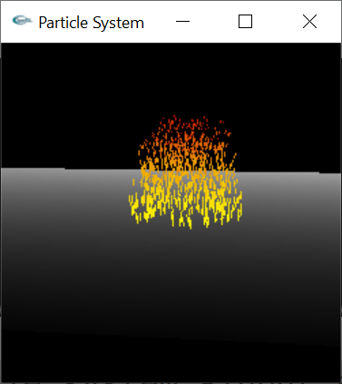

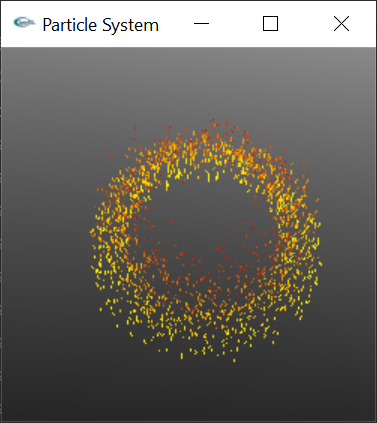


